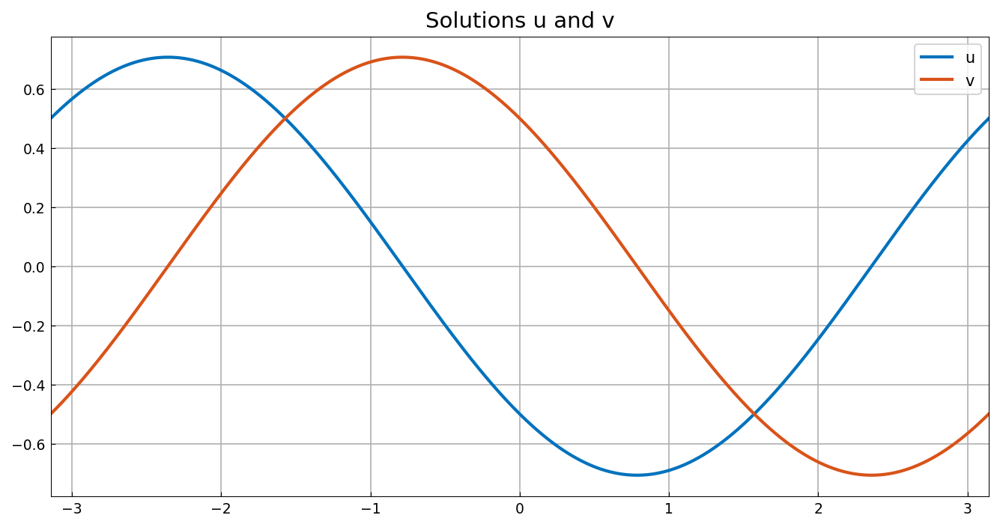

# Periodic ODE systems

*Hadrien Montanelli, December 2014*

[Original MATLAB Chebfun example](https://www.chebfun.org/examples/ode-linear/PeriodicSystem.html)

(Chebfun example ode-linear/PeriodicSystem.m)

Chebfun solves coupled systems of ODEs with periodic boundary
conditions. Consider

$$ u - v' = 0, \qquad u'' + v = \cos x, \qquad x \in [-\pi, \pi], $$

with periodic conditions on both unknowns, whose exact solution is
$u = \cos(x + 3\pi/4)/\sqrt 2$, $v = \cos(x + \pi/4)/\sqrt 2$:

```python
A = Chebop(lambda x, u, v: [u - v.diff(), u.diff(2) + v], domain=(-pi, pi))
A.bc = 'periodic'
u, v = A.solve([0, lambda t: cos(t)])
```

```text
ans =
   chebfun column (1 smooth piece)
       interval       length     endpoint values trig
[    -3.1,     3.1]        3       0.5      0.5 
vertical scale = 0.68 
err =
     4.999910722329645e-16
```

(Published: trig length 5, error 8.2e-14 — chebfunjax stores 3 trig
coefficients where MATLAB counts 5 sample points; the error is at
machine precision either way.)



Introducing a breakpoint (`domain=(-pi, 0, pi)`) switches to a
piecewise Chebyshev discretization: continuity rows glue the pieces
and *wrap-around rows* $u^{(d)}(-\pi) = u^{(d)}(\pi)$ impose
periodicity, with the condition rows distributed across the equation
blocks in proportion to each equation's differential order:

```text
ans =
   chebfun column (2 smooth pieces)
       interval       length     endpoint values  
[    -3.1,       0]       17       0.5     -0.5 
[       0,     3.1]       17      -0.5      0.5 
vertical scale = 0.7    Total length = 34
err =
     9.063679943206277e-14
```

(Published: pieces of length 16, error 4.6e-14 — same structure to one
adaptive step, same accuracy class.)


---

*Replica script: [`examples/ode-linear/periodic_system_replica.py`](https://github.com/ma-gilles/chebfunjax/blob/main/examples/ode-linear/periodic_system_replica.py).
Original example copyright by The University of Oxford and The Chebfun
Developers.*
