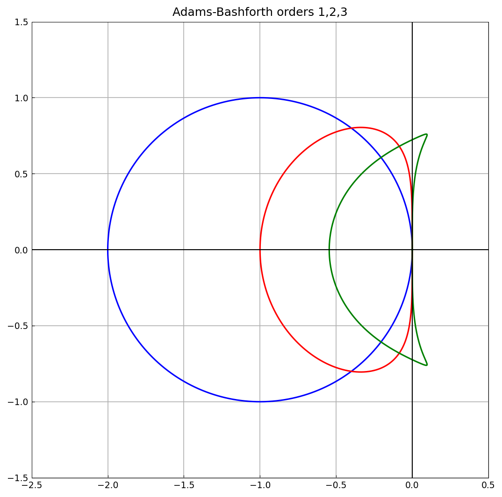
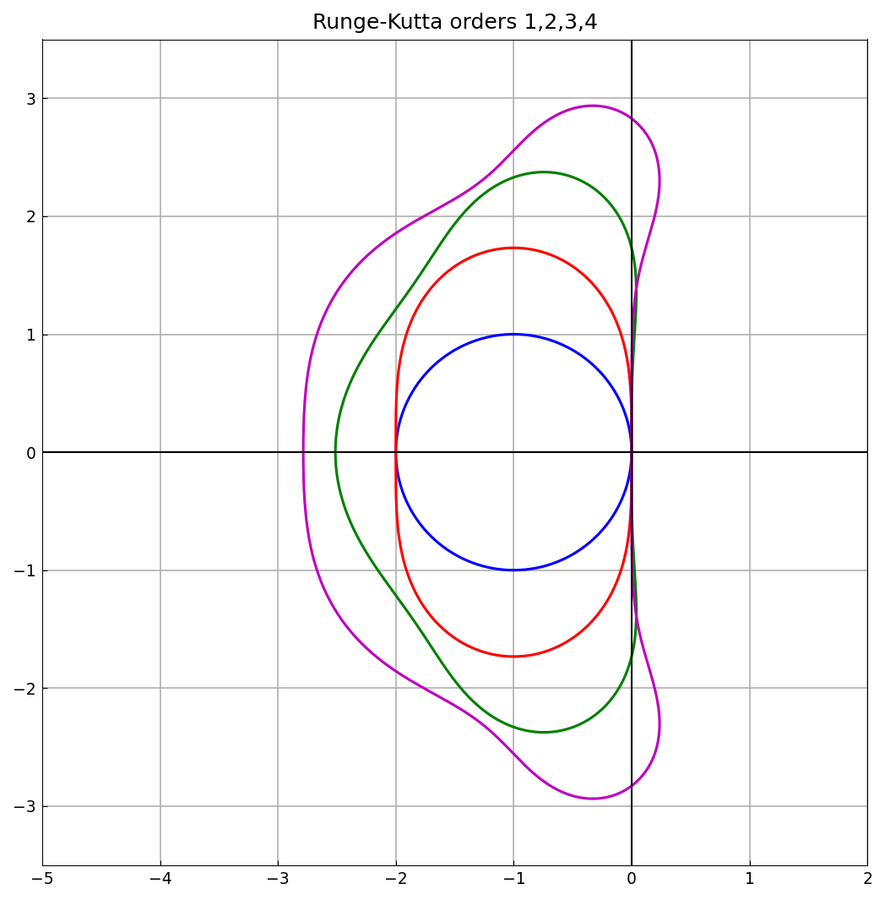
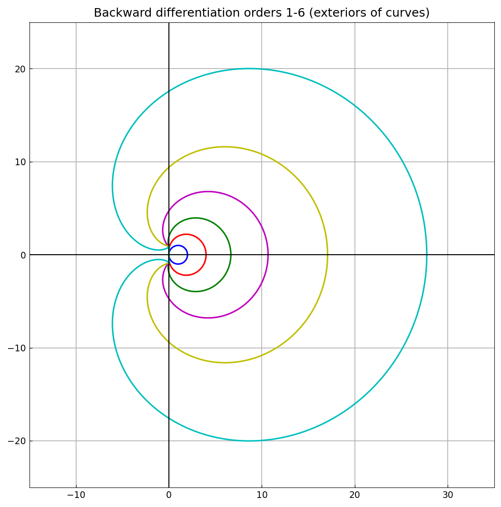
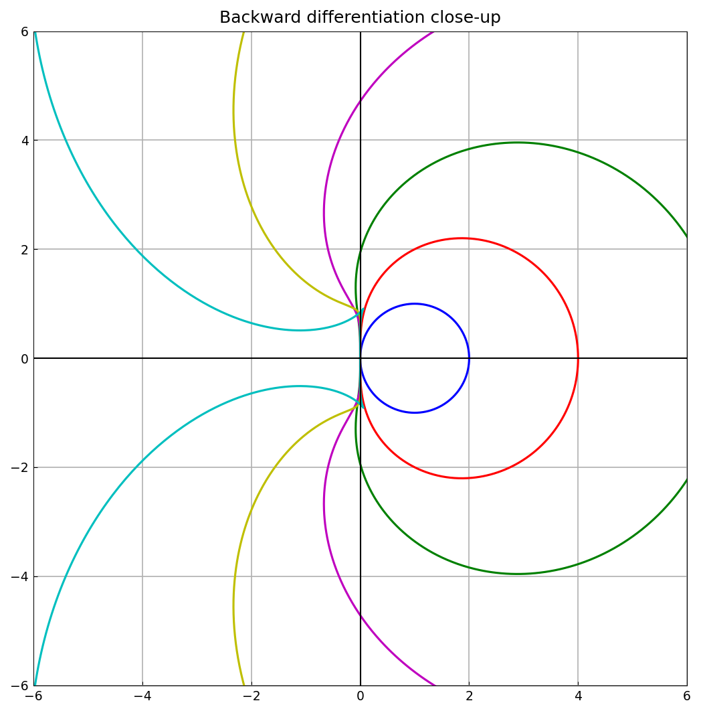

# Stability regions of ODE formulas

*Nick Trefethen, February 2011*

[Original MATLAB Chebfun example](https://www.chebfun.org/examples/ode-linear/Regions.html)

(Chebfun example ode-linear/Regions.m)

Stability regions of linear multistep and Runge-Kutta formulas are
regions of the complex $\lambda\Delta t$-plane, bounded by curves that
can be traced as complex-valued chebfuns of a parameter $t$ on
$[0, 2\pi]$ with $z = e^{it}$.

**Adams-Bashforth 1-3.** The boundary is $r(z)/s(z)$ with
$r = z - 1$ and $s$ the order-dependent characteristic polynomial in
$1/z$:

**Runge-Kutta 1-4.** The boundary satisfies
$p(w) = z^{\,\mathrm{order}}$ where $p$ is the truncated exponential
series; a few Newton iterations *on chebfuns* solve for $w(t)$:

**Backward differentiation 1-6.** The stability regions are the
*exteriors* of the curves $r = \sum_{i} d^i/i$ with $d = 1 - 1/z$:

A close-up shows that the higher-order BDF curves cross into the left
half-plane, so BDF5 and BDF6 are not A-stable:

---

*Replica script: [`examples/ode-linear/regions_replica.py`](https://github.com/ma-gilles/chebfunjax/blob/main/examples/ode-linear/regions_replica.py).
Original example copyright by The University of Oxford and The Chebfun
Developers.*
