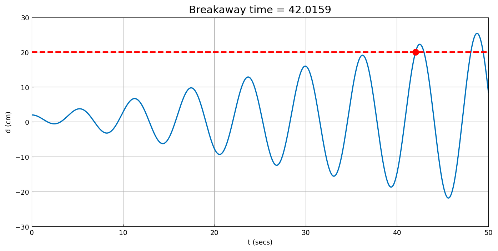

# Resonant vandalism

*Nick Trefethen, December 2012*

[Original MATLAB Chebfun example](https://www.chebfun.org/examples/ode-linear/ResonantVandal.html)

(Chebfun example ode-linear/ResonantVandal.m)

A vandal pushes a lamppost resonantly at its natural frequency. The
deflection $d$ (cm) obeys

$$ d'' + d = 1 - \cos t, \qquad d(0) = 2, ~ d'(0) = 0, $$

whose resonant response grows linearly in amplitude. The lamppost
snaps when the deflection reaches 20 cm — the *breakaway time* found
with `roots`:

```text
breakaway_time =
  42.015895524938593
```

(Published: `42.015895525074392` — 10-digit agreement, limited by the
marched-IVP tolerance.)



The maximum deflection over $t \in [35, 40]$, computed on the
restriction `d{35,40}`:

```text
ans =
  19.126234408618366
```

(Published: `19.126234407727370` — same 9-digit story.)

---

*Replica script: [`examples/ode-linear/resonant_vandal_replica.py`](https://github.com/ma-gilles/chebfunjax/blob/main/examples/ode-linear/resonant_vandal_replica.py).
Original example copyright by The University of Oxford and The Chebfun
Developers.*
