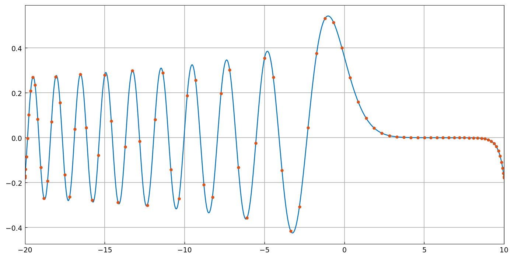
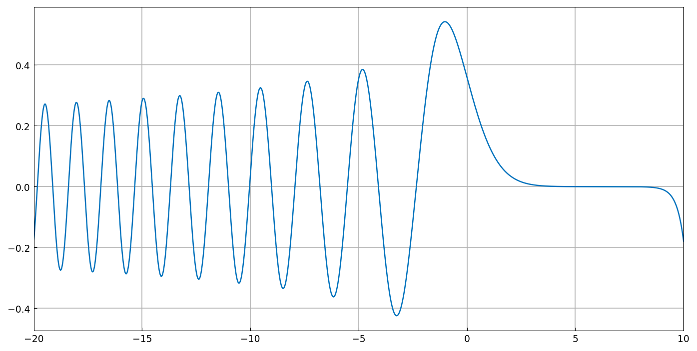

# Rectangular spectral discretizations

*Nick Trefethen, April 2016*

[Original MATLAB Chebfun example](https://www.chebfun.org/examples/ode-linear/SpectralDisc.html)

(Chebfun example ode-linear/SpectralDisc.m)

Chebfun's block-operator tools expose the rectangular spectral
discretization machinery directly. The Airy-like problem

$$ u'' - xu = 0, \qquad \int_{-20}^{10} u = 1, \quad u(10) = u(-20), $$

can be discretized by hand with a rectangular differentiation matrix
mapping $n+2$ points to $n$ rows plus one integration row (`introw`)
and one evaluation-difference row (`diffrow`):

```python
L  = diffmat((n, n+2), 2, domain=X) - diag(gridsample(x, n, X)) @ diffmat((n, n+2), 0, domain=X)
vT = introw(n+2, domain=X)
wT = diffrow(n+2, 0, 10, domain=X) - diffrow(n+2, 0, -20, domain=X)
A  = vstack([L, vT, wT]);  u = solve(A, rhs)
```



The same problem in one line of chebop, with the side conditions in
the general `.bc` field:



```text
ans =
    64
```

(Published: `93` — the adaptive lengths differ; both resolve the Airy
oscillations to machine precision.)

To see the structure, here are the full system matrices for
$n = 1, \dots, 4$ — digit-for-digit the published values:

```text
A =
    0.0044    4.9911    0.0044
    5.0000   20.0000    5.0000
   -1.0000    0.0000    1.0000
A =
   20.0237   -0.0415    0.0296   -0.0119
   -0.0119    0.0296   -0.0415   -9.9763
    1.6667   13.3333   13.3333    1.6667
   -1.0000    0.0000    0.0000    1.0000
A =
   20.0756   -0.1266    0.0800   -0.0512    0.0222
   -0.0044    0.0178    4.9733    0.0178   -0.0044
    0.0222   -0.0512    0.0800   -0.1266   -9.9244
    1.0000    8.0000   12.0000    8.0000    1.0000
   -1.0000    0.0000    0.0000    0.0000    1.0000
A =
   20.1849   -0.3038    0.1815   -0.1051    0.0781   -0.0356
   -1.8626    6.0695    9.7812   -2.2839    1.4119   -0.6161
    0.1339   -0.3070    0.4972   -1.9999   -1.2116    0.3874
   -0.0356    0.0781   -0.1051    0.1815   -0.3038   -9.8151
    0.6000    5.4111    8.9889    8.9889    5.4111    0.6000
   -1.0000    0.0000    0.0000    0.0000    0.0000    1.0000
```

## References

1. T. A. Driscoll and N. Hale, "Rectangular spectral collocation",
   IMA J. Numer. Anal. 36 (2016), 108-132.
2. K. Xu and N. Hale, "Explicit construction of rectangular
   differentiation matrices", IMA J. Numer. Anal. 36 (2016), 618-632.

---

*Replica script: [`examples/ode-linear/spectral_disc_replica.py`](https://github.com/ma-gilles/chebfunjax/blob/main/examples/ode-linear/spectral_disc_replica.py).
Original example copyright by The University of Oxford and The Chebfun
Developers.*
