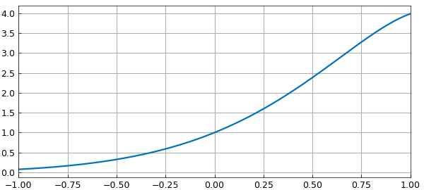
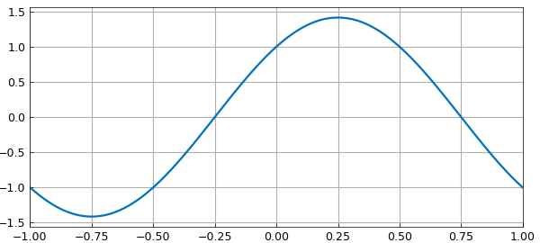
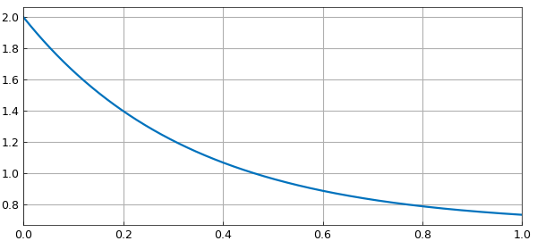

# Wikipedia ODE examples

*Mark Richardson, September 2010*

[Original MATLAB Chebfun example](https://www.chebfun.org/examples/ode-linear/WikiODE.html)

Python translation: [`examples/ode-linear/wiki_ode.py`](https://github.com/ma-gilles/chebfunjax/blob/main/examples/ode-linear/wiki_ode.py)

Here, we solve three simple linear problems considered in the Wikipedia article on ODEs [1]. The problems are solved in the order they appear in the article, with boundary conditions imposed to make the solutions unique.

## Problem 1: Second-order problem

$$ L(y) = y'' - 4y' + 5y = 0, \quad y(-1) = e^{-2} \cos(-1) , ~~ y(1) = e^2\cos(1). $$

Begin by defining the domain $d$, chebfun variable $x$ and operator $N$.

```matlab
d = [-1 1];
x = chebfun('x',d);
N = chebop(d);
```

The problem has Dirichlet boundary conditions.

```matlab
N.lbc = exp(-2)*cos(-1);
N.rbc = exp(2)*cos(1);
```

Define the linear operator.

```matlab
N.op = @(y) diff(y,2) - 4*diff(y,1) + 5*y;
```

Define the right-hand side of the ODE.

```matlab
rhs = 0;
```

Solve the ODE using backslash.

```matlab
y = N\rhs;
```

Analytic solution.

```matlab
y_exact = exp(2*x)*cos(x);
```

How close is the computed solution to the true solution?

```matlab
norm(y-y_exact)
```

```text
ans =
     9.388216433131806e-12
```

Plot the computed solution.

```matlab
plot(y), grid on
```



## Problem 2: Simple harmonic oscillator

$$ L(y) = y'' + \pi^2 y = 0, \qquad y(-1) = -1, ~~ y'(1) = -\pi. $$

```matlab
d = [-1 1];
x = chebfun('x',d);
N = chebop(d);
N.op = @(y) diff(y,2) + pi^2*y;
```

This problem has a Dirichlet boundary condition on the left,

```matlab
N.lbc = -1;
```

and a Neumann condition on the right.

```matlab
N.rbc = @(u) diff(u) + pi;
```

Define the right-hand side of the ODE.

```matlab
rhs = 0;
```

Solve the ODE using backslash.

```matlab
y = N\rhs;
```

Analytic solution.

```matlab
y_exact = cos(pi*x)+sin(pi*x);
```

How close is the computed solution to the true solution?

```matlab
norm(y-y_exact)
```

```text
ans =
     4.057216976353058e-13
```

Plot the computed solution.

```matlab
plot(y), grid on
```



## Problem 3: First-order problem

$$ L(y) = y' + 3y = 2 \qquad y(0) = 2 . $$

```matlab
d = [0 1];
x = chebfun('x',d);
N = chebop(d);
```

First-order problems require only one boundary condition.

```matlab
N.lbc = 2;
```

Define the linear operator.

```matlab
N.op = @(y) diff(y) + 3*y - 2;
```

Define the right-hand side of the ODE.

```matlab
rhs = 0;
```

Solve the ODE using backslash.

```matlab
y = N\rhs;
```

Analytic solution, usually found with integrating factors.

```matlab
y_exact = 2/3 + 4/3*exp(-3*x);
```

How close is the computed solution to the true solution?

```matlab
norm(y-y_exact)
```

```text
ans =
     2.854619845707265e-12
```

Plot the computed solution

```matlab
plot(y), grid on
```



## References

1. [http://en.wikipedia.org/wiki/Linear_differential_equation](http://en.wikipedia.org/wiki/Linear_differential_equation).

---

*Translated with [chebfunjax](https://github.com/ma-gilles/chebfunjax); prose and MATLAB code from the original example, copyright The University of Oxford and The Chebfun Developers.  Printed outputs and figures are chebfunjax's.*
