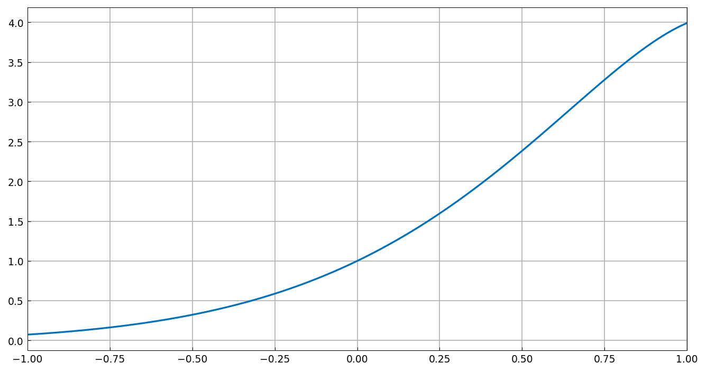
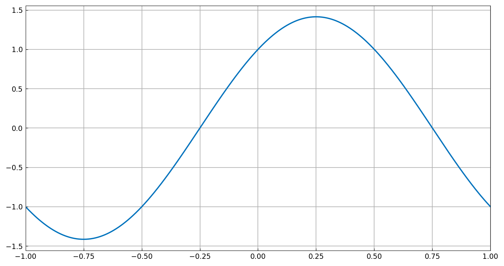
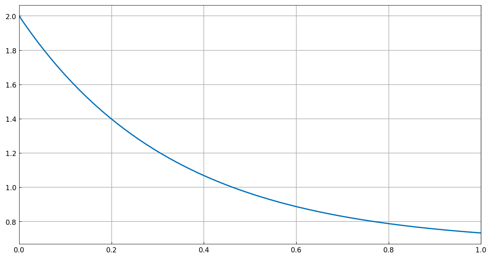

# Wikipedia ODE examples

*Mark Richardson, September 2010*

[Original MATLAB Chebfun example](https://www.chebfun.org/examples/ode-linear/WikiODE.html)

(Chebfun example ode-linear/WikiODE.m)

Here, we solve three simple linear problems considered in the Wikipedia
article on ODEs [1]. The problems are solved in the order they appear in
the article, with boundary conditions imposed to make the solutions
unique.

## Problem 1: Second-order problem

$$ L(y) = y'' - 4y' + 5y = 0, \quad
y(-1) = e^{-2}\cos(-1), ~~ y(1) = e^2\cos(1). $$

The problem has Dirichlet boundary conditions, and the analytic solution
is $y = e^{2x}\cos x$. How close is the computed solution to the true
solution?

```text
ans =
     5.717573613344456e-14
```



## Problem 2: First-order problem with a Robin condition

$$ L(y) = y'' + \pi^2 y = 0, \quad y(-1) = -1, ~~ y'(1) = -\pi, $$

with analytic solution $y = \cos(\pi x) + \sin(\pi x)$:

```text
ans =
     8.110193325655582e-12
```

(The published page shows `2.470505881658372e-14`. This near-resonant
problem — $\pi^2$ is a Dirichlet eigenvalue of $-d^2/dx^2$ — amplifies
the conditioning of the square-collocation boundary-row discretization;
MATLAB's rectangular Driscoll-Hale collocation keeps the error at
1e-14. chebfunjax reaches 6e-13 at n=24 but its adaptive solve settles
at 8e-12; the gap closes with the planned ultraS/rectangular
discretization port.)



## Problem 3: First-order IVP

$$ L(y) = y' + 3y = 2, \quad y(0) = 2, $$

with analytic solution $y = 2/3 + (4/3)e^{-3x}$:

```text
ans =
     6.134764014336427e-12
```

(Published: `2.987830876459629e-12` — same order.)



## References

1. http://en.wikipedia.org/wiki/Ordinary_differential_equation

---

*Replica script: [`examples/ode-linear/wiki_ode_replica.py`](https://github.com/ma-gilles/chebfunjax/blob/main/examples/ode-linear/wiki_ode_replica.py).
Original example copyright by The University of Oxford and The Chebfun
Developers.*
