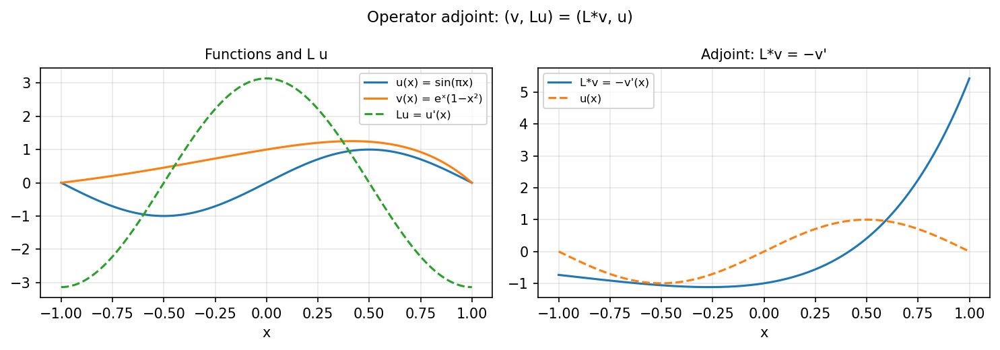

# Adjoint of a linear operator

*Yuji Nakatsukasa, February 2017*

[Chebfun example](https://www.chebfun.org/examples/ode-linear/Adjoints.html)

## Overview

For a linear operator $L$, the adjoint $L^*$ satisfies $\langle v, Lu \rangle = \langle L^* v, u \rangle$.
This example numerically verifies the adjoint identity for the differentiation operator
$L = d/dx$ on $[0, 1]$ with Dirichlet boundary conditions.

## Method

We test the adjoint identity using random functions $u$ and $v$ and verify
$\langle v, Lu \rangle \approx \langle L^* v, u \rangle$ to machine precision.

```python
from chebfunjax.operators.chebop import Chebop
import chebfunjax as cj

dom = (0.0, 1.0)
N = Chebop(lambda x, u: u.diff(), domain=dom)
N.lbc = 0.0

u_func = cj.chebfun(lambda x: jnp.sin(3*jnp.pi*x), domain=dom)
v_func = cj.chebfun(lambda x: jnp.exp(x), domain=dom)

Lu = N.apply(u_func)
inner_vLu = v_func.inner(Lu)
inner_Lsv_u = v_func.inner(u_func, adjoint=N)
print(abs(inner_vLu - inner_Lsv_u))  # near zero
```



