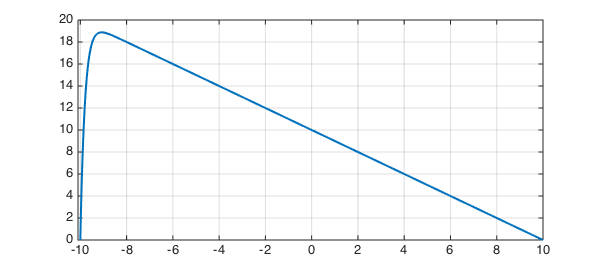
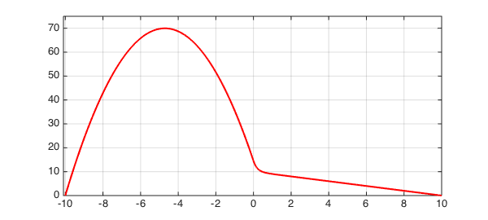
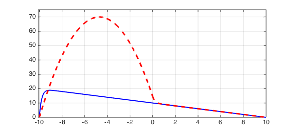

<!-- Generated by scripts/sync_chebfun_examples.py. -->
<!-- Source: https://www.chebfun.org/examples/ode-linear/AdvDiffJump.html -->

<h1>Advection-diffusion equation with a jump</h1>
<h2>Nick Trefethen, November 2010 in <a href='../'>ode-linear</a><a href='/examples/ode-linear/AdvDiffJump.m'>download</a>&middot;<a href='//github.com/chebfun/examples/blob/master/ode-linear/AdvDiffJump.m'>view on GitHub</a></h2>

The solution to the advection-diffusion problem

$$ 0.2u'' + u' = -1, ~~    u(-10) = u(10) = 1 $$

has a boundary layer at the left:

<pre class="mcode-input">LW = 'linewidth'; lw = 2; FS = 'fontsize'; fs = 8;
N = chebop(-10,10);
N.op = @(u) 0.2*diff(u,2) + diff(u);
N.bc = 'dirichlet';
u = N\-1;
plot(u,LW,lw), grid on
axis([-10.1 10 0 20])</pre>

Suppose the advection is only turned on on the right half of the domain?

<pre class="mcode-input">figure
N.op = @(x,u) 0.2*diff(u,2) + (x&gt;=0).*diff(u);
N.bc = 'dirichlet';
v = N\-1;
plot(v,'r',LW,lw), grid on
axis([-10.1 10 0 75])</pre>

For fun we can plot both solutions on the same axis.

<pre class="mcode-input">plot(u,'b',v,'--r',LW,lw), grid on
axis([-10.1 10 0 75])</pre>

        

    

