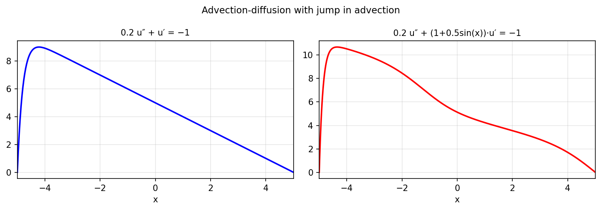

# Advection-diffusion equation with a jump

*Nick Trefethen, November 2010*

[Chebfun example](https://www.chebfun.org/examples/ode-linear/advdiffjump.html)

## Overview

Solves the advection-diffusion boundary value problem

$$\varepsilon u'' + c(x) u' = -1, \quad u(-1) = u(1) = 0$$

with a piecewise coefficient $c(x)$ that has a jump at $x=0$.
The solution develops a boundary or interior layer for small $\varepsilon$.

## Method

The Chebop operator handles the piecewise $c(x)$ transparently.
We compare constant and piecewise advection coefficients.

```python
from chebfunjax.operators.chebop import Chebop

dom = (-1.0, 1.0)
eps = 0.1
N = Chebop(lambda x, u: eps * u.diff(2) + u.diff(), domain=dom)
N.lbc = 0.0; N.rbc = 0.0
u = N.solve(-1.0)
```



