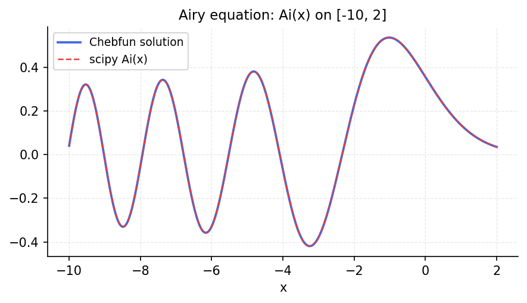

# Airy equation

*chebfunjax team*

## Overview

Solves the Airy equation

$$u'' = x u, \quad u(a) = \text{Ai}(a), \; u(b) = \text{Ai}(b)$$

where $\text{Ai}(x)$ is the Airy function of the first kind.
The spectral solution is compared against scipy's `airy` function.

```python
from chebfunjax.operators.chebop import Chebop
from scipy.special import airy

dom = (-10.0, 4.0)
a, b = dom
ai_a, _, _, _ = airy(a)
ai_b, _, _, _ = airy(b)

N = Chebop(lambda x, u: u.diff(2) - x * u, domain=dom)
N.lbc = float(ai_a)
N.rbc = float(ai_b)
u = N.solve(0.0)
```

## Results

The Chebop solution matches the Airy function to near machine precision
across the domain, including the rapidly oscillating region $x < 0$.


