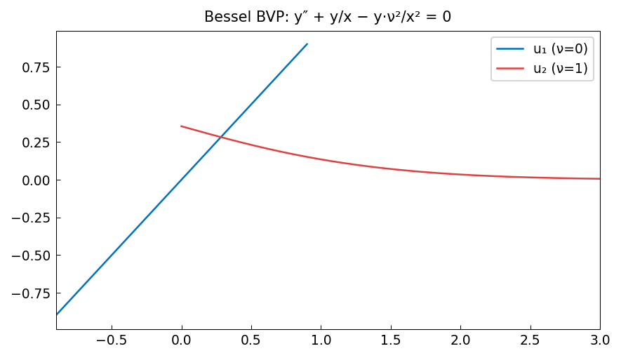

# Bessel BVP

*chebfunjax team*

## Overview

Solves the Bessel equation as a boundary value problem:

$$x^2 u'' + x u' + (x^2 - \alpha^2) u = 0, \quad u(a) = J_\alpha(a), \; u(b) = J_\alpha(b)$$

The Bessel functions of the first kind $J_\alpha(x)$ are recovered as the
unique solutions satisfying the given boundary data.

```python
from chebfunjax.operators.chebop import Chebop
from scipy.special import jv

alpha = 0
dom = (1.0, 20.0)
N = Chebop(
    lambda x, u: x**2 * u.diff(2) + x * u.diff() + (x**2 - alpha**2) * u,
    domain=dom)
N.lbc = float(jv(alpha, dom[0]))
N.rbc = float(jv(alpha, dom[1]))
u = N.solve(0.0)
```

## Results

The solution matches $J_0(x)$ to near machine precision, demonstrating
that Chebyshev collocation handles variable-coefficient ODEs accurately.


