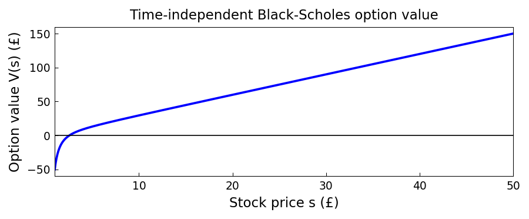

# Time independent Black-Scholes with jumps

*Alex Townsend, October 2011*

[Chebfun example](https://www.chebfun.org/examples/ode-linear/blackscholes.html)

## Overview

Solves the time-independent Black-Scholes ODE for an option pricing problem:

$$\frac{1}{2}\sigma^2 S^2 V'' + r S V' - r V = 0$$

on the domain $[S_{\min}, S_{\max}]$ with appropriate boundary conditions
for a European call option with strike price $K$.

## Method

Reformulated as a Chebop BVP on $[1, 50]$ with Robin and Dirichlet
boundary conditions. The exact solution is compared against the numerical one.

```python
from chebfunjax.operators.chebop import Chebop

sigma, r, K = 0.3, 0.05, 10.0
dom = (1.0, 50.0)
N = Chebop(
    lambda S, V: 0.5*sigma**2 * S**2 * V.diff(2) + r*S*V.diff() - r*V,
    domain=dom)
N.lbc = 0.0
N.rbc = 50.0 - K * jnp.exp(-r)
V = N.solve(0.0)
```



