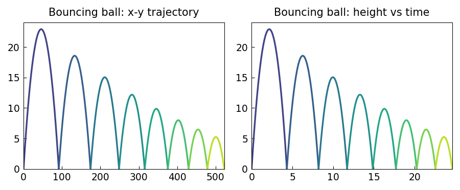

# A bouncing ball

*Filomena Di Tommaso, February 2013*

[Chebfun example](https://github.com/chebfun/examples/blob/master/ode-linear/BouncingBall.m)

## Overview

Simulates a bouncing ball subject to gravity. Between bounces, the trajectory
is a parabola: $y(t) = y_0 + v_0 t - \tfrac{g}{2} t^2$. At each bounce,
the velocity reverses with a restitution coefficient $\alpha < 1$,
causing the ball to eventually come to rest.

## Method

Pure piecewise quadratic simulation — no ODE solver needed.

```python
import numpy as np

g = 9.81
alpha = 0.7  # coefficient of restitution
y0, v0 = 1.0, 0.0
t_bounce = np.sqrt(2 * y0 / g)
# Simulate several bounces
t_vals, y_vals = [], []
t = 0.0
while abs(v0) > 1e-8 or y0 > 1e-10:
    ts = np.linspace(t, t + t_bounce, 100)
    ys = y0 + v0*(ts-t) - 0.5*g*(ts-t)**2
    t_vals.append(ts); y_vals.append(np.maximum(ys, 0))
    v_impact = v0 - g * t_bounce
    v0 = -alpha * v_impact
    t = t + t_bounce
    t_bounce = 2 * abs(v0) / g
```



