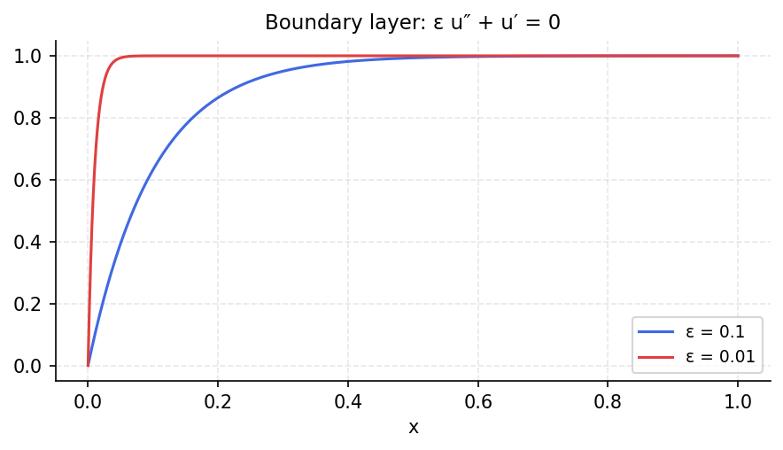

# Boundary layer for advection-diffusion equation

*Nick Trefethen, October 2010*

[Chebfun example](https://www.chebfun.org/examples/ode-linear/boundarylayer.html)

## Overview

Solves the singularly-perturbed BVP

$$\varepsilon u'' + u' = 0, \quad u(0) = 0, \; u(1) = 1$$

for small values of $\varepsilon$. The solution develops an exponential
boundary layer of thickness $O(\varepsilon)$ near $x = 0$.

## Method

The exact solution $u(x) = (1 - e^{-x/\varepsilon})/(1 - e^{-1/\varepsilon})$
is compared against the Chebop numerical solution.

```python
from chebfunjax.operators.chebop import Chebop

dom = (0.0, 1.0)
for eps in [0.1, 0.01, 0.001]:
    N = Chebop(lambda x, u: eps * u.diff(2) + u.diff(), domain=dom)
    N.lbc = 0.0; N.rbc = 1.0
    u = N.solve(0.0)
```



