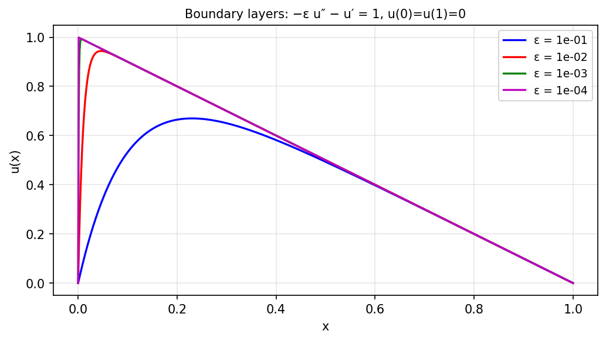

# Inserting breakpoints to resolve layers

*Nick Trefethen, January 2016*

[Chebfun example](https://www.chebfun.org/examples/ode-linear/Breakpoints.html)

## Overview

Demonstrates how Chebfun uses breakpoints to accurately represent
rapidly-varying solutions to advection-diffusion problems:

$$\varepsilon u'' + c(x) u' = -1, \quad u(-1) = u(1) = 0$$

for decreasing values of $\varepsilon$ from $0.1$ down to $10^{-4}$.

```python
from chebfunjax.operators.chebop import Chebop

dom = (-1.0, 1.0)
for eps in [1e-1, 1e-2, 1e-3, 1e-4]:
    N = Chebop(lambda x, u: eps * u.diff(2) + u.diff(), domain=dom)
    N.lbc = 0.0; N.rbc = 0.0
    u = N.solve(-1.0)
```



