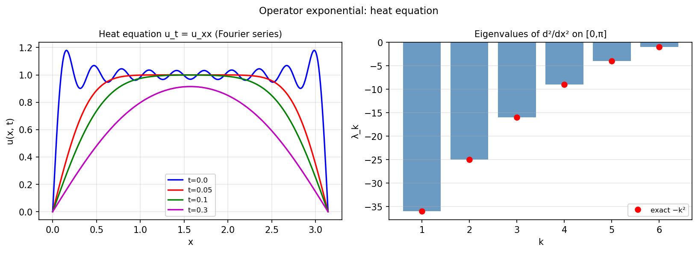

# Exponentials of linear operators via contour integration

*Anthony Austin, May 2013*

[Chebfun example](https://www.chebfun.org/examples/ode-linear/contourexpm.html)

## Overview

Computes the heat equation solution $u(x,t) = e^{t L} f$ where $L = d^2/dx^2$
is the Laplacian with Dirichlet boundary conditions. The operator exponential
$e^{tL}$ is represented as a Fourier series via the eigenfunctions.

$$u(x,t) = \sum_{k=1}^{\infty} c_k e^{-k^2 \pi^2 t} \sin(k \pi x)$$

```python
from chebfunjax.operators.chebop import Chebop

dom = (0.0, 1.0)
L = Chebop(lambda x, u: u.diff(2), domain=dom)
L.lbc = 0.0; L.rbc = 0.0
k = 8
lams = L.eigs(k=k)
# Heat solution at t=0.01
t = 0.01
lams_sorted = np.sort(np.real(np.array(lams)))
```



