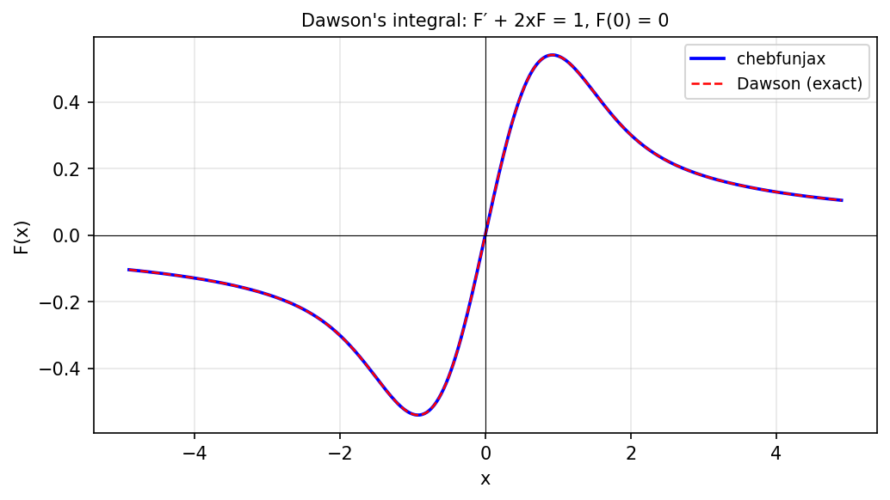

# Dawson's integral

*Kuan Xu, October 2012*

[Chebfun example](https://www.chebfun.org/examples/ode-linear/DawsonIntegral.html)

## Overview

Dawson's integral $F(x) = e^{-x^2}\int_0^x e^{t^2}\,dt$ satisfies the ODE

$$F'(x) + 2x F(x) = 1, \quad F(0) = 0.$$

This example solves the ODE numerically and compares with the scipy
implementation of Dawson's integral.

```python
from chebfunjax.operators.chebop import Chebop
from scipy.special import dawsn

dom = (0.0, 4.0)
N = Chebop(lambda x, u: u.diff() + 2.0 * x * u, domain=dom)
N.lbc = 0.0
F = N.solve(1.0)
```



