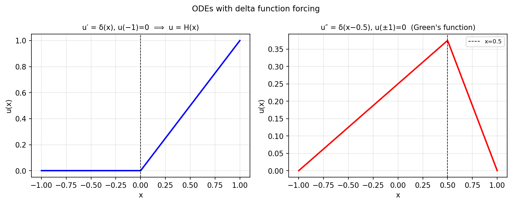

# Delta functions and ODEs

*Mohsin Javed, July 2012*

[Chebfun example](https://github.com/chebfun/examples/blob/master/ode-linear/DeltaODEs.m)

## Overview

Explores delta-function forcing for ODEs. The solution to

$$u'' = \delta(x - x_0), \quad u(a) = u(b) = 0$$

is the Green's function — a piecewise-linear tent function.

## Method

Instead of a true delta function, we approximate it with a narrow Gaussian
and verify the solution converges to the exact piecewise solution.

```python
from chebfunjax.operators.chebop import Chebop

dom = (-1.0, 1.0)
x0, eps_delta = 0.0, 1e-3
# Approximate delta as narrow Gaussian
def f_approx(x):
    return jnp.exp(-0.5*((x - x0)/eps_delta)**2) / (eps_delta * jnp.sqrt(2*jnp.pi))

N = Chebop(lambda x, u: u.diff(2), domain=dom)
N.lbc = 0.0; N.rbc = 0.0
u = N.solve(f_approx)
```



