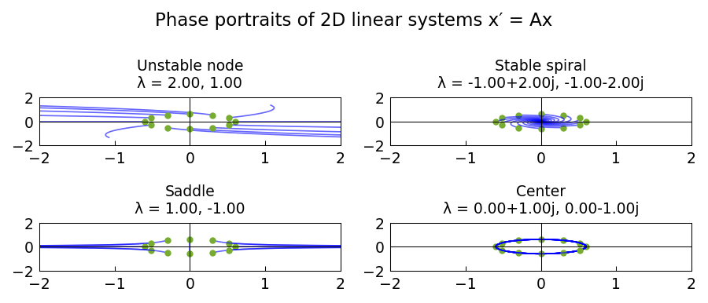

# Classification of linear dynamical systems

*Georges Klein, March 2013*

[Chebfun example](https://www.chebfun.org/examples/ode-linear/DynamicalSystems.html)

## Overview

Classifies 2D linear dynamical systems $\dot{\mathbf{x}} = A \mathbf{x}$
by the nature of their equilibrium at the origin: stable/unstable node,
spiral, center, or saddle — determined by the eigenvalues of $A$.

## Method

For several canonical matrices $A$, integrates trajectories using
`scipy.integrate.solve_ivp` and plots the phase portraits.

```python
from scipy.integrate import solve_ivp

# Stable spiral: A has complex eigenvalues with negative real part
A_stable = np.array([[-1, 2], [-2, -1]])
def f_spiral(t, y): return A_stable @ y
sol = solve_ivp(f_spiral, [0, 10], [1, 0], rtol=1e-10)
```



