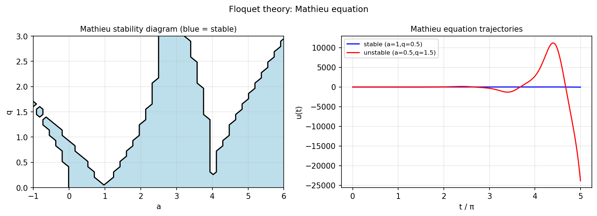

# Floquet theory of periodic linear systems

*Richard Mikael Slevinsky, October 2014*

[Chebfun example](https://www.chebfun.org/examples/ode-linear/Floquet.html)

## Overview

Studies the Mathieu equation $u'' + (a - 2q\cos(2x))u = 0$, a classic
example in Floquet theory. For certain parameters $(a, q)$ the solutions
are periodic (stable); for others they grow exponentially (unstable).

## Method

The monodromy matrix is computed numerically for each $(a, q)$ pair.
Stability is determined by whether both Floquet multipliers lie on the
unit circle.

```python
from scipy.integrate import solve_ivp

def mathieu_rhs(t, y, a, q):
    u, du = y
    return [du, -(a - 2*q*np.cos(2*t))*u]

# Monodromy matrix from two independent solutions
```



