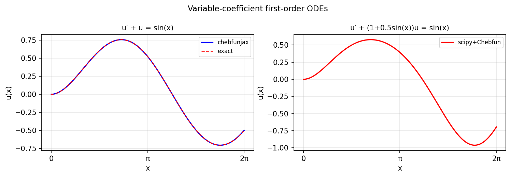

# Fourier spectral collocation

*Hadrien Montanelli, December 2014*

[Chebfun example](https://www.chebfun.org/examples/ode-linear/fouriercollocation.html)

## Overview

Solves the periodic ODE $u' + a(x)u = f(x)$ on $[0, 2\pi]$ using Fourier
spectral collocation, enabled by setting `N.bc = "periodic"` in the Chebop.

The exact solution for $a = 1$, $f = \sin(x)$ is
$u = (\sin x - \cos x)/2$.

```python
from chebfunjax.operators.chebop import Chebop

dom = (0.0, 2.0 * np.pi)
N = Chebop(lambda x, u: u.diff() + u, domain=dom)
N.bc = "periodic"
f = lambda x: jnp.sin(x)
u = N.solve(f)
```



