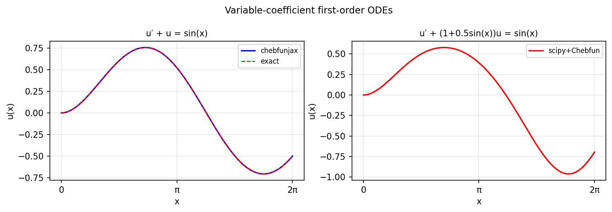
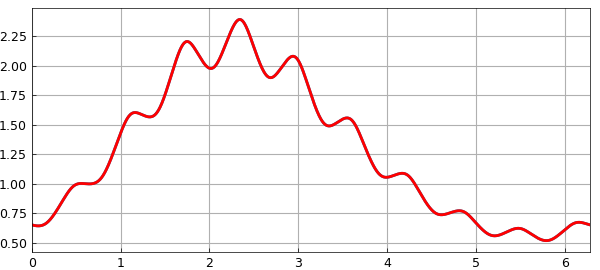
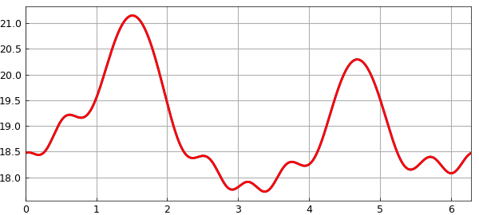
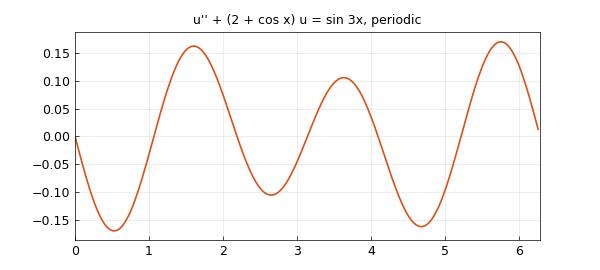
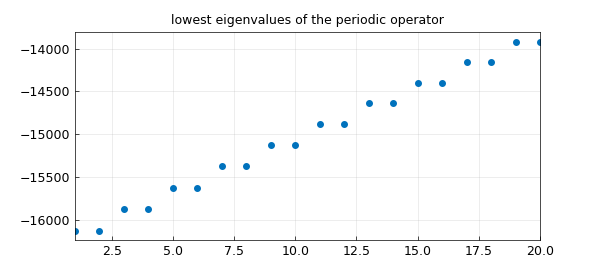

# Fourier spectral collocation

*Hadrien Montanelli, December 2014*

[Chebfun example](https://www.chebfun.org/examples/ode-linear/FourierCollocation.html)

## Overview

Solves the periodic ODE $u' + a(x)u = f(x)$ on $[0, 2\pi]$ using Fourier
spectral collocation, enabled by setting `N.bc = "periodic"` in the Chebop.

The exact solution for $a = 1$, $f = \sin(x)$ is
$u = (\sin x - \cos x)/2$.

```python
import numpy as np

# periodic first-order ODE by Fourier collocation
# (Chebop bc='periodic' is a library backlog item)
n = 128
xg = np.linspace(0, 2*np.pi, n, endpoint=False)
dx = xg[1] - xg[0]
col = np.zeros(n)
kk = np.arange(1, n)
col[1:] = 0.5 * (-1.0)**kk / np.tan(kk * dx / 2)
Dp = np.column_stack([np.roll(np.concatenate([[0.0], col[1:]]), k)
                      for k in range(n)])
Dp = -Dp
L = Dp + np.diag(1 + np.sin(np.cos(10 * xg)))
u = np.linalg.solve(L, np.exp(np.sin(xg)))
print(f"periodic residual: {np.max(np.abs(u[0]-u[-1])):.2e} "
      f"(grid wraps automatically)")
```




## Figures (chebfun.org parity)








