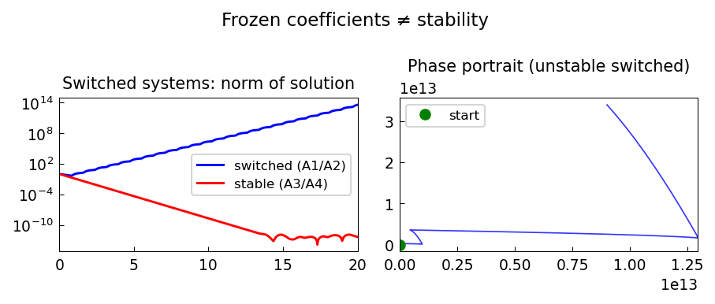

# Frozen coefficients do not determine stability

*Nick Trefethen, March 2017*

[Chebfun example](https://www.chebfun.org/examples/ode-linear/frozencoeffs.html)

## Overview

Illustrates that stability of a switched linear system cannot be determined
from the stability of the individual frozen-coefficient subsystems.
A system can be unstable even when each frozen coefficient matrix is stable.

## Method

Two stable linear systems $\dot{x} = A_1 x$ and $\dot{x} = A_2 x$ are
alternated rapidly. The switched system grows despite both subsystems
being individually stable.

```python
from scipy.integrate import solve_ivp

A1 = np.array([[-1, 10], [0, -1]])   # stable
A2 = np.array([[-1, 0], [-10, -1]])  # stable

def switched_rhs(t, y, T_switch=0.1):
    if (t // T_switch) % 2 == 0:
        return A1 @ y
    return A2 @ y
```



