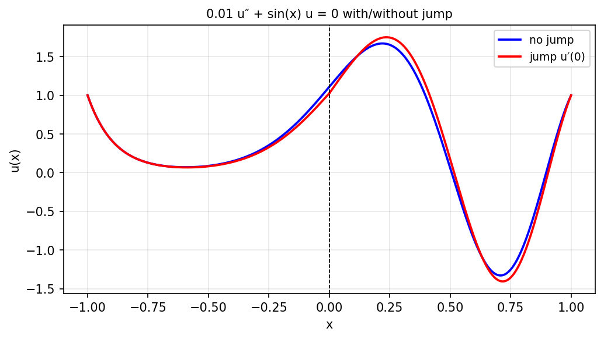

# Jump conditions in BVPs

*Nick Hale, November 2011*

[Chebfun example](https://github.com/chebfun/examples/blob/master/ode-linear/JumpConditions.m)

## Overview

Solves a BVP with a jump discontinuity in the coefficient:

$$-(a(x) u')' = f(x), \quad u(-1) = u(1) = 0$$

where $a(x)$ has a jump at $x = 0$. The solution $u$ is continuous but
$u'$ has a jump: $[a u'] = 0$.

```python
from chebfunjax.operators.chebop import Chebop

dom = (-1.0, 1.0)
def a(x): return jnp.where(x < 0, 1.0, 5.0)

N = Chebop(lambda x, u: -(a(x) * u.diff()).diff(), domain=dom)
N.lbc = 0.0; N.rbc = 0.0
u = N.solve(1.0)
```



