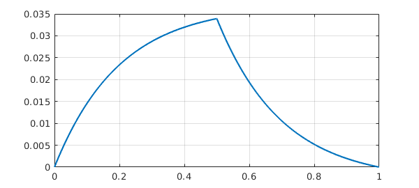
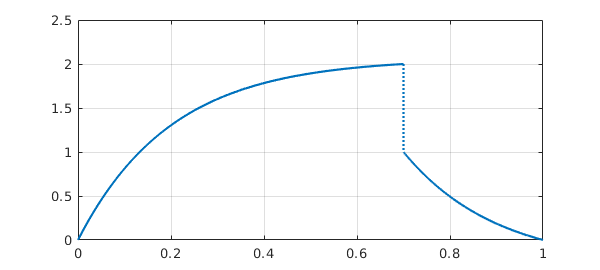
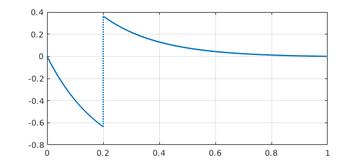
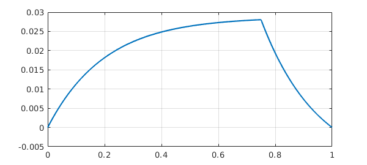
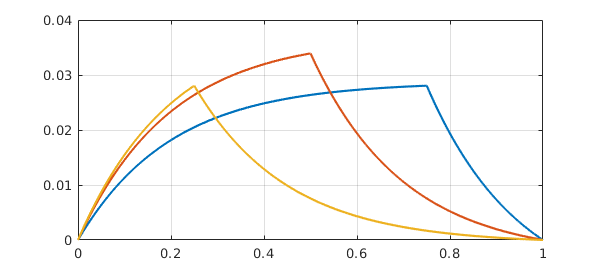
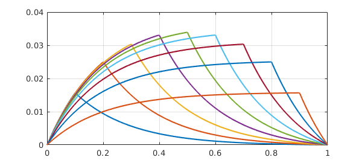

<!-- Generated by scripts/sync_chebfun_examples.py. -->
<!-- Source: https://www.chebfun.org/examples/ode-linear/JumpGreen.html -->

<h1>Jump conditions and Green functions</h1>
<h2>Nick Hale and Nick Trefethen, June 2019 in <a href='../'>ode-linear</a><a href='/examples/ode-linear/JumpGreen.m'>download</a>&middot;<a href='//github.com/chebfun/examples/blob/master/ode-linear/JumpGreen.m'>view on GitHub</a></h2>

Chebfun allows you to specify jump conditions in ODE BVPs. For example, a 2nd-order ODE would normally take two boundary conditions, like this advection-diffusion equation:

<pre class="mcode-input">eta = 0.2;
L = chebop(@(x,u) eta*diff(u,2) + diff(u), [0 1]);
L.lbc = 0; L.rbc = 0;</pre>

But suppose we want a continuous solution whose derivative jumps by $-1/\eta$ at $x=1/2$?  Mathematically, this is like having one 2nd-order BVP on $[0,1/2]$ coupled to another on $[1/2,1]$, and we will need four boundary conditions in total.  The two additional boundary conditions will assert that at $x=1/2$, the derivative jumps by $-1/\eta$ whereas the function value is continuous.  Chebfun allows you to specify these conditions like this:

<pre class="mcode-input">L.bc = @(x,u) [jump(u,1/2) ; jump(diff(u),1/2)+eta];
plot(L\0), grid on</pre>

Incidentally, <code>jump</code> is an abbreviation based on a more general Chebfun capability involving evaluations on the left and the right of a point.  For example, we could do this:

<pre class="mcode-input">L.bc = @(x,u) [feval(u,.7,'left')-2 ; feval(u,.7,'right')-1];
plot(L\0), grid on</pre>

Returning to the convenience of <code>jump</code>, suppose we want a jump in the function value and continuity of the derivative.  We could do this:

<pre class="mcode-input">L.bc = @(x,u) [jump(u,.2)-1; jump(diff(u),.2)];
plot(L\0), grid on</pre>

Now a Green's function for a linear ODE is a solution to a homogeneous BVP with a derivative jump condition at a point $s$ in the interior. The configuration at the beginning of this example was of exactly this kind.  Here is the same calculation but for $s=0.75$.

<pre class="mcode-input">L.bc = @(x,u) [jump(u,0.75) ; jump(diff(u),0.75)+eta];
plot(L\0), grid on</pre>

Let's superimpose results for $s=0.5$ and $s=0.25$:

<pre class="mcode-input">hold on
for s = .5:-.25:.25
  L.bc = @(x,u) [jump(u,s) ; jump(diff(u),s)+eta];
  plot(L\0)
end
hold off</pre>

Actually, we can combine Matlab's anonymous functions and Chebfun's ODE capabilities to make a single object that constructs this Green function:

<pre class="mcode-input">green = @(s) chebop(@(x,u) eta*diff(u,2) + diff(u), [0 1], ...
     @(x,u) [u(0); u(1); jump(u,s); jump(diff(u),s)+eta])\0;</pre>

Here is an illustration for $s = 0.1, 0.2, \dots, 0.9$.

<pre class="mcode-input">for s = .1:.1:.9
  plot(green(s)), hold on
end
grid on, hold off</pre>

        

    

    

        
&copy; Copyright 2025 the University of Oxford and the Chebfun Developers.

        
    

    
    
    
    
    
    
    
    
  </body>
</html>

