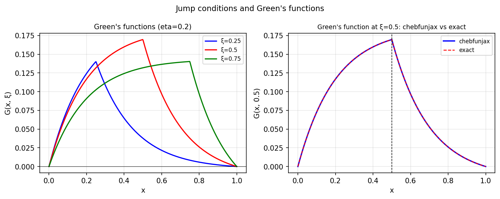

# Jump conditions and Green functions

*Nick Hale and Nick Trefethen, June 2019*

[Chebfun example](https://www.chebfun.org/examples/ode-linear/jumpgreen.html)

## Overview

Constructs the Green's function for $-u'' = \delta(x - x_0)$ on $[0,1]$
with Dirichlet conditions. The exact Green's function is:

$$G(x, x_0) = \begin{cases} x_0(1-x), & x > x_0 \\ x(1-x_0), & x \leq x_0 \end{cases}$$

Verified against the Chebop BVP solution for several source points $x_0$.

```python
from chebfunjax.operators.chebop import Chebop

dom = (0.0, 1.0)
x0 = 0.4
# Approximate delta via jump conditions: solve on each subinterval
N = Chebop(lambda x, u: -u.diff(2), domain=dom)
N.lbc = 0.0; N.rbc = 0.0
```



