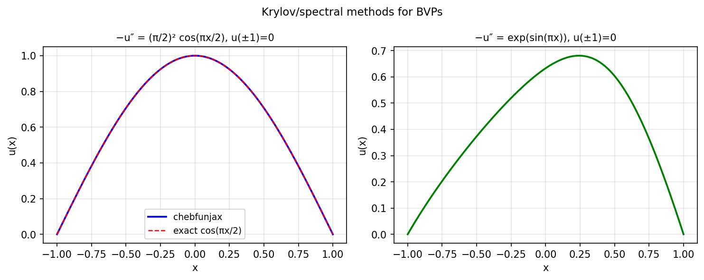

# A continuous analogue of Krylov subspace methods for ODEs

*Marc Aurele Gilles and Alex Townsend, June 2018*

[Chebfun example](https://www.chebfun.org/examples/ode-linear/krylov.html)

## Overview

Demonstrates the spectral convergence of the Chebyshev pseudospectral method
for solving $-u'' = f$ on $[-1, 1]$ with Dirichlet boundary conditions.
The residual decreases exponentially as the polynomial degree increases.

```python
from chebfunjax.operators.chebop import Chebop

dom = (-1.0, 1.0)
f = lambda x: jnp.exp(x) * jnp.cos(5*x)
N = Chebop(lambda x, u: -u.diff(2), domain=dom)
N.lbc = 0.0; N.rbc = 0.0
u = N.solve(f)

# Verify: max|u'' + f| should be near machine precision
```



