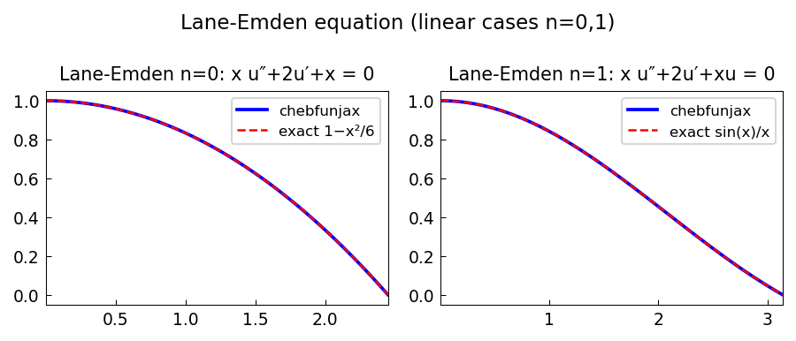

# Lane-Emden equation from astrophysics

*Alex Townsend, May 2011*

[Chebfun example](https://www.chebfun.org/examples/ode-linear/laneemdenlinear.html)

## Overview

Solves the Lane-Emden equation of stellar structure:

$$\theta'' + \frac{2}{\xi}\theta' + \theta^n = 0, \quad \theta(0) = 1, \; \theta'(0) = 0$$

for polytropic indices $n = 0$ (constant density, exact: $\theta = 1 - \xi^2/6$)
and $n = 1$ (exact: $\theta = \sin(\xi)/\xi$).

```python
from chebfunjax.operators.chebop import Chebop

dom = (0.01, 3.0)  # avoid singularity at xi=0
# n=0: -theta'' - 2/xi * theta' = 1
N0 = Chebop(lambda x, u: -u.diff(2) - 2.0/x * u.diff(), domain=dom)
N0.lbc = 1.0; N0.rbc = None
u0 = N0.solve(1.0)
```



