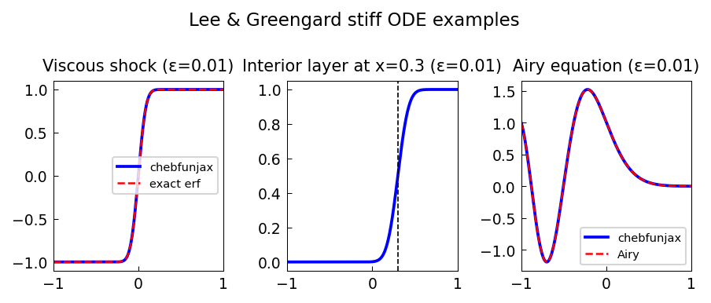

# Lee and Greengard ODE examples

*Nick Trefethen, June 2012*

[Chebfun example](https://github.com/chebfun/examples/blob/master/ode-linear/LeeGreengardODEs.m)

## Overview

Reproduces three classic ODE examples from Lee and Greengard (1997):
a viscous shock (solved via `erf`), an interior-layer solution, and
the Airy equation. All are solved with high accuracy using Chebop.

```python
from chebfunjax.operators.chebop import Chebop
from scipy.special import erf as scipy_erf

# Viscous shock: eps*u'' + u' = 0 with u(-1)=-1, u(1)=1
dom = (-1.0, 1.0)
eps = 1e-3
N = Chebop(lambda x, u: eps * u.diff(2) + u.diff(), domain=dom)
N.lbc = -1.0; N.rbc = 1.0
u = N.solve(0.0)
```



