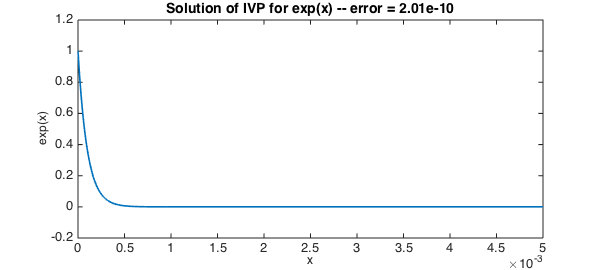

<!-- Generated by scripts/sync_chebfun_examples.py. -->
<!-- Source: https://www.chebfun.org/examples/ode-linear/LinExpIVP.html -->

<h1>Linear <code>exp</code> initial-value problem</h1>
<h2>Tom Maerz, October 2010 in <a href='../'>ode-linear</a><a href='/examples/ode-linear/LinExpIVP.m'>download</a>&middot;<a href='//github.com/chebfun/examples/blob/master/ode-linear/LinExpIVP.m'>view on GitHub</a></h2>

This is an elementary example to illustrate how one might use Chebfun to solve a very simple ODE initial-value problem. We take the scalar test problem

$$ u' - \lambda u = 0  ,~~~    u(0) = 1,~  \lambda = -10000 $$

on the interval $[0,.005]$.  The solution is $\exp(\lambda x)$.

<pre class="mcode-input">d = [0,.005];                       % domain
x = chebfun('x',d);                 % x variable
L = chebop(d);                      % operator
lambda = -10000;                    % specifying parameter lambda
L.op = @(u) diff(u,1) - lambda*u;   % linear operator defining the ODE
L.lbc = @(u) u-1;                   % imposing Dirichlet boundary condition
u = L\0;                            % solve the problem
plot(u,'linewidth',1.6)             % plot the solution
err = norm(u-exp(lambda*x),inf);    % measure the error
FS = 'fontsize';
xlabel('x',FS,12)
ylabel('exp(x)',FS,12)
title(sprintf('Solution of IVP for exp(x) -- error = %7.2e',err),FS,14)</pre>

        

