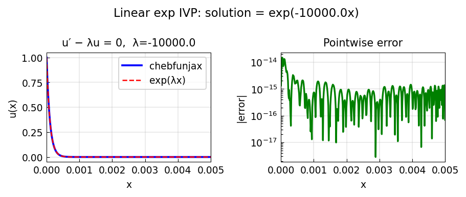

# Linear exp initial-value problem

*Tom Maerz, October 2010*

[Chebfun example](https://www.chebfun.org/examples/ode-linear/LinExpIVP.html)

## Overview

Solves the stiff IVP $u' - \lambda u = 0$ with $\lambda = -10000$
on the short interval $[0, 0.005]$. The exact solution is $u = e^{\lambda t}$.

This demonstrates Chebop's ability to handle stiff problems via spectral
collocation without explicit stiffness detection.

```python
from chebfunjax.operators.chebop import Chebop

dom = (0.0, 0.005)
lam = -10000.0
N = Chebop(lambda t, u: u.diff() - lam * u, domain=dom)
N.lbc = 1.0
u = N.solve(0.0)
```



