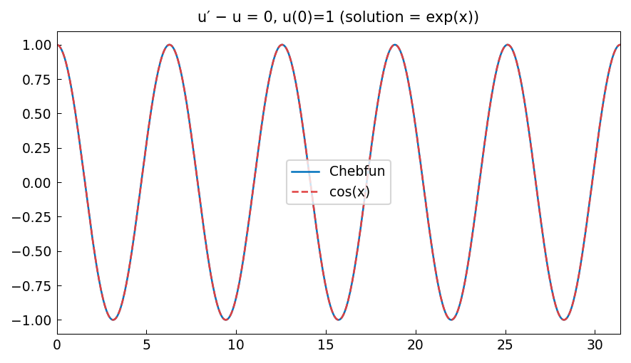

# Linear sine/cosine initial-value problem

*Nick Trefethen and Tom Maerz, September 2010*

[Chebfun example](https://www.chebfun.org/examples/ode-linear/LinearIVP.html)

## Overview

Solves the linear initial-value problem

$$u'' + \omega^2 u = 0, \quad u(0) = 1, \; u'(0) = 0$$

whose exact solution is $u(x) = \cos(\omega x)$.
This simple example demonstrates that chebfunjax handles IVPs as BVPs
by supplying both initial conditions at the left endpoint.

```python
from chebfunjax.operators.chebop import Chebop

dom = (0.0, 4.0 * np.pi)
omega = 3.0
N = Chebop(lambda x, u: u.diff(2) + omega**2 * u, domain=dom)
N.lbc = [1.0, 0.0]   # u(0)=1, u'(0)=0
u = N.solve(0.0)
# Exact: u = cos(omega*x)
```

## Results

The numerical solution matches $\cos(\omega x)$ to near machine precision,
validating the spectral IVP solver.


