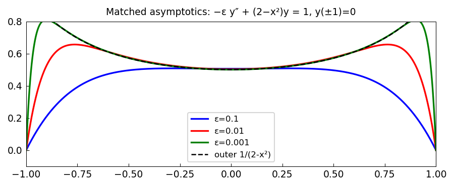

# Matched asymptotics and boundary layers

*Nick Trefethen, December 2010*

[Chebfun example](https://www.chebfun.org/examples/ode-linear/matchedasymp.html)

## Overview

Solves $-\varepsilon y'' + (2 - x^2) y = 1$ with $y(\pm 1) = 0$ for small
$\varepsilon$. As $\varepsilon \to 0$, the WKB/outer solution and the
inner (boundary layer) solution are matched using asymptotic analysis.

The numerical solution is compared with the leading-order matched asymptotic
approximation.

```python
from chebfunjax.operators.chebop import Chebop

dom = (-1.0, 1.0)
for eps in [0.1, 0.01, 0.001]:
    N = Chebop(
        lambda x, u: -eps * u.diff(2) + (2 - x**2) * u,
        domain=dom)
    N.lbc = 0.0; N.rbc = 0.0
    u = N.solve(1.0)
```



