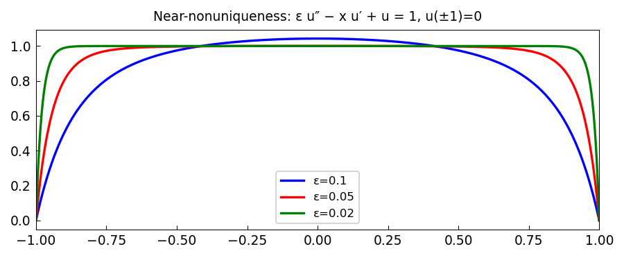

# Near-nonuniqueness and near-nonexistence

*Nick Trefethen, October 2016*

[Chebfun example](https://www.chebfun.org/examples/ode-linear/NearNonuniqueness.html)

## Overview

Examines the BVP $\varepsilon u'' - x u' + u = 1$ on $[-1, 1]$ with
$u(\pm 1) = 0$. As $\varepsilon \to 0$, the problem approaches one
with a non-trivial null function $u_* = x$, leading to near-nonuniqueness
or near-nonexistence depending on the sign of the right-hand side.

```python
from chebfunjax.operators.chebop import Chebop

dom = (-1.0, 1.0)
for eps in [0.1, 0.01]:
    N = Chebop(
        lambda x, u: eps * u.diff(2) - x * u.diff() + u,
        domain=dom)
    N.lbc = 0.0; N.rbc = 0.0
    u = N.solve(1.0)
```



