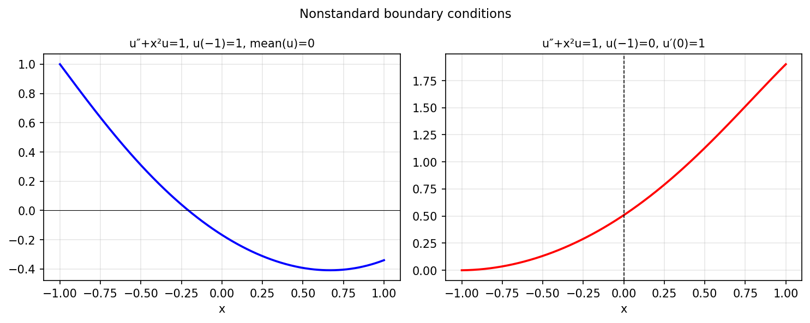

# Nonstandard boundary conditions

*Asgeir Birkisson, October 2011*

[Chebfun example](https://www.chebfun.org/examples/ode-linear/NonstandardBCs.html)

## Overview

Solves BVPs with nonstandard boundary conditions, including:
- A mean-zero condition: $\int_{-1}^{1} u(x)\,dx = 0$
- An interior derivative condition: $u'(0) = 0$

These conditions cannot be expressed as evaluations at the endpoints
and require special treatment in numerical methods.

```python
from chebfunjax.operators.chebop import Chebop
from scipy.optimize import brentq

dom = (-1.0, 1.0)
# Shift a to enforce mean zero
def u_with_shift(a):
    N = Chebop(lambda x, u: u.diff(2) + u, domain=dom)
    N.lbc = a; N.rbc = 0.0
    u = N.solve(1.0)
    x_q = jnp.linspace(-1, 1, 500)
    return float(jnp.mean(jnp.array(u(x_q))))
a_zero = brentq(u_with_shift, -5, 5)
```



