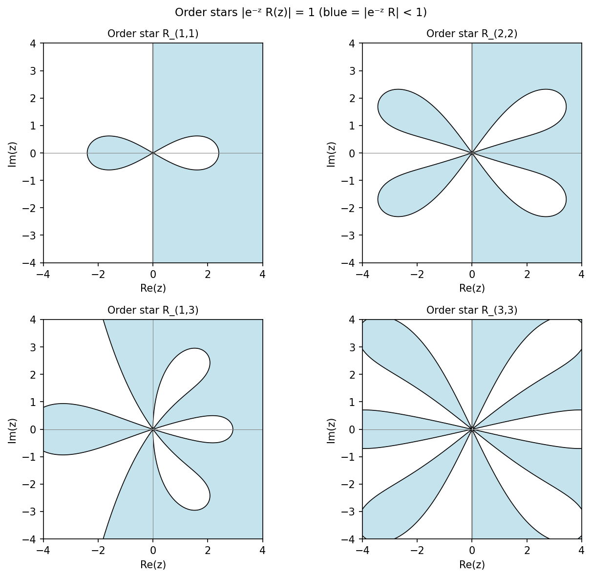

# Order stars

*Nick Trefethen, July 2014*

[Chebfun example](https://www.chebfun.org/examples/ode-linear/orderstars.html)

## Overview

Visualizes order stars for Pade approximants to the exponential function
$e^z$. An order star for a rational approximant $R(z)$ is the set
$\{ z \in \mathbb{C} : |R(z)| < |e^z| \}$, which encodes information
about the approximant's accuracy and stability.

## Method

The $(p, q)$ Pade approximant of $e^z$ is computed symbolically and then
evaluated on a fine grid in the complex plane.

```python
import numpy as np

# Pade [2,2] approximant to exp(z)
def pade22(z):
    num = 1 + z/2 + z**2/12
    den = 1 - z/2 + z**2/12
    return num / den

z_re = np.linspace(-4, 4, 300)
z_im = np.linspace(-4, 4, 300)
Z = z_re[:, None] + 1j * z_im[None, :]
order_star = np.abs(pade22(Z)) < np.abs(np.exp(Z))
```



