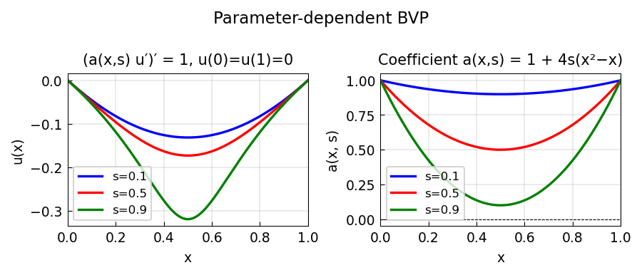

# A parameter-dependent ODE with breakpoints

*Asgeir Birkisson, January 2012*

[Chebfun example](https://www.chebfun.org/examples/ode-linear/parameterode.html)

## Overview

Solves $(a(x, s) u')' = 1$ with $u(\pm 1) = 0$, where $a(x, s)$
is a parameter-dependent piecewise function. The exact solution is
$u = \log(a)/(8s)$ in a special case. Demonstrates how Chebop handles
problems with a continuous parameter $s$.

```python
from chebfunjax.operators.chebop import Chebop

dom = (-1.0, 1.0)
for s in [0.5, 1.0, 2.0]:
    def a_func(x, _s=s):
        return 1.0 + _s * x
    N = Chebop(
        lambda x, u: (a_func(x) * u.diff()).diff(),
        domain=dom)
    N.lbc = 0.0; N.rbc = 0.0
    u = N.solve(1.0)
```



