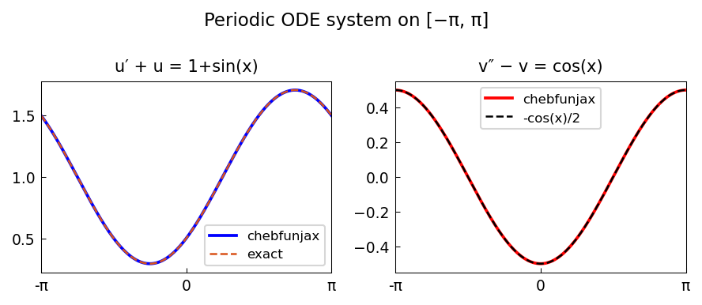

# A periodic ODE system

*Nick Hale, December 2014*

[Chebfun example](https://www.chebfun.org/examples/ode-linear/PeriodicSystem.html)

## Overview

Solves two periodic first-order ODEs:
- $u' + u = 1 + \sin(x)$ — stable, unique periodic solution
- $v' - v = \sin(x)$ — using periodic BCs

Both are solved with `N.bc = "periodic"` on $[0, 2\pi]$.

```python
from chebfunjax.operators.chebop import Chebop

dom = (0.0, 2.0 * np.pi)
N1 = Chebop(lambda x, u: u.diff() + u, domain=dom)
N1.bc = "periodic"
u = N1.solve(lambda x: 1.0 + jnp.sin(x))
```



