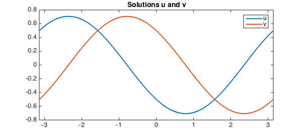
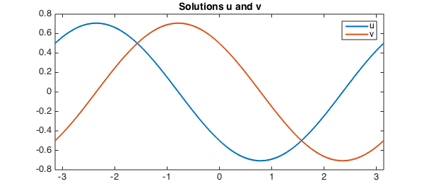

<!-- Generated by scripts/sync_chebfun_examples.py. -->
<!-- Source: https://www.chebfun.org/examples/ode-linear/PeriodicSystem.html -->

<h1>A periodic ODE system</h1>
<h2>Nick Hale, December 2014 in <a href='../'>ode-linear</a><a href='/examples/ode-linear/PeriodicSystem.m'>download</a>&middot;<a href='//github.com/chebfun/examples/blob/master/ode-linear/PeriodicSystem.m'>view on GitHub</a></h2>

Chebfun can solve systems of ODEs with periodic boundary conditions. For example, consider the equations

$$ u - v' = 0, \qquad u'' + v = \cos(x) $$

on the interval $[-\pi, \pi]$ with periodic boundary conditions on $u$ and $v$. A Chebfun solution could be put together like this:

<pre class="mcode-input">d = [-pi,pi];
A = chebop(d);
A.op = @(x,u,v) [u-diff(v); diff(u,2)+v];
x = chebfun('x',d);
f = [0;cos(x)];
A.bc = 'periodic';
u = A\f;
u{1}, u{2}</pre>

<pre class="mcode-output">ans =
   chebfun column (1 smooth piece)
       interval       length   endpoint values trig
[    -3.1,     3.1]        5       0.5      0.5 
Epslevel = 1.570092e-15.  Vscale = 6.984011e-01.
ans =
   chebfun column (1 smooth piece)
       interval       length   endpoint values trig
[    -3.1,     3.1]       33      -0.5     -0.5 
Epslevel = 1.570092e-15.  Vscale = 7.069065e-01.
</pre>

Because the boundardy conditions are periodic, the system of ODEs is solved with a Fourier collocation method, and the solution $u$ is represented by a Fourier series. (This is what <code>trig</code> means in the display of $u$ above.) We plot the result:

<pre class="mcode-input">LW = 'linewidth'; lw = 2; FS = 'fontsize'; fs = 14;
plot(u,LW,lw), title('Solutions u and v',FS,fs), legend('u','v');</pre>

For this problem, the solution can actually be computed analytically. How close were we?

<pre class="mcode-input">exact = [cos(x+3*pi/4) cos(x+pi/4)]/sqrt(2);
err = max([norm(u{1}-exact(:,1),inf) norm(u{2}-exact(:,2),inf)])</pre>

<pre class="mcode-output">err =
     8.207219039300383e-14
</pre>

We show this also works for piecewise problems by artificially introducing a breakpoint at the origin.

<pre class="mcode-input">A.domain = [-pi,0,pi];
u = A\f;
u{1}, u{2}</pre>

<pre class="mcode-output">ans =
   chebfun column (2 smooth pieces)
       interval       length   endpoint values  
[    -3.1,       0]       16       0.5     -0.5 
[       0,     3.1]       16      -0.5      0.5 
Epslevel = 1.571719e-15.  Vscale = 7.063751e-01.  Total length = 32.
ans =
   chebfun column (2 smooth pieces)
       interval       length   endpoint values  
[    -3.1,       0]       16      -0.5      0.5 
[       0,     3.1]       16       0.5     -0.5 
Epslevel = 1.571719e-15.  Vscale = 7.063751e-01.  Total length = 32.
</pre>

The solution is now represented by a Chebyshev series, and the equation has been solved with a Chebyshev collocation method, because Fourier collocation methods can't handle breakpoints.

<pre class="mcode-input">plot(u,LW,lw), title('Solutions u and v',FS,fs), legend('u','v');
err = max([norm(u{1}-exact(:,1),inf) norm(u{2}-exact(:,2),inf)])</pre>

<pre class="mcode-output">err =
     4.582320677971030e-14
</pre>

        

    

