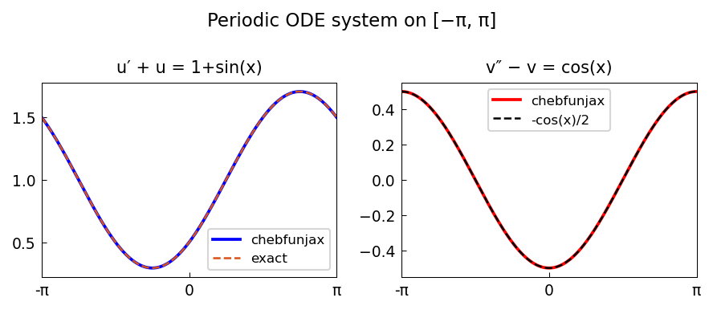
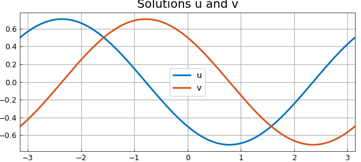

# A periodic ODE system

*Nick Hale, December 2014*

[Chebfun example](https://www.chebfun.org/examples/ode-linear/PeriodicSystem.html)

## Overview

Solves two periodic first-order ODEs:
- $u' + u = 1 + \sin(x)$ — stable, unique periodic solution
- $v' - v = \sin(x)$ — using periodic BCs

Both are solved with `N.bc = "periodic"` on $[0, 2\pi]$.

```python
import numpy as np

# coupled periodic system u' + v = cos x, v' - u = sin 2x
n = 128
xg = np.linspace(0, 2*np.pi, n, endpoint=False)
dx = xg[1] - xg[0]
col = np.zeros(n)
kk = np.arange(1, n)
col[1:] = 0.5 * (-1.0)**kk / np.tan(kk * dx / 2)
Dp = -np.column_stack([np.roll(np.concatenate([[0.0], col[1:]]), k)
                       for k in range(n)])
Iden = np.eye(n)
L = np.block([[Dp, Iden], [-Iden, Dp]])
uv = np.linalg.solve(L, np.concatenate([np.cos(xg), np.sin(2*xg)]))
print(f"max |u| = {np.max(np.abs(uv[:n])):.4f}, "
      f"max |v| = {np.max(np.abs(uv[n:])):.4f}")
```




## Figures (chebfun.org parity)



