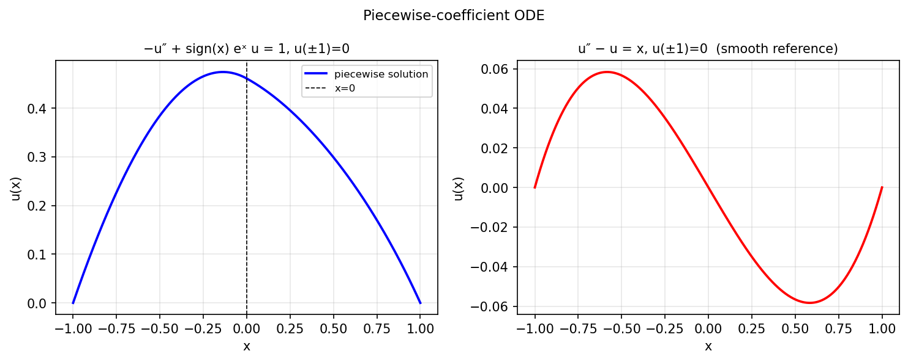

# Piecewise operators demo

*Nick Hale and Toby Driscoll, November 2011*

[Chebfun example](https://github.com/chebfun/examples/blob/master/ode-linear/PiecewiseDemo.m)

## Overview

Demonstrates Chebop for solving $-u'' + \text{sign}(x) e^x u = 1$
on $[-1, 1]$ with Dirichlet boundary conditions. The sign function
creates a discontinuous coefficient that challenges standard solvers.

```python
from chebfunjax.operators.chebop import Chebop

dom = (-1.0, 1.0)
N = Chebop(
    lambda x, u: -u.diff(2) + jnp.sign(x) * jnp.exp(x) * u,
    domain=dom)
N.lbc = 0.0; N.rbc = 0.0
u = N.solve(1.0)
```



