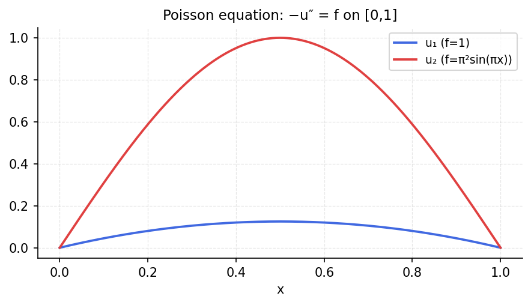

# Poisson Equation

*Original: [chebfun.org/examples/ode-linear/PoissonEquation](https://www.chebfun.org/examples/ode-linear/PoissonEquation.html)*

---

The 1D Poisson equation $-u'' = f(x)$ with Dirichlet boundary conditions
$u(-1) = u(1) = 0$ is the simplest elliptic boundary value problem. Its
spectral discretization gives a dense but well-conditioned system.

## Spectral method

Using a Chebyshev differentiation matrix, the BVP becomes a linear system:

```python
import numpy as np
import scipy.special

def cheb_diff_matrix(n):
    """Chebyshev differentiation matrix of size (n+1) x (n+1)."""
    x = np.cos(np.pi * np.arange(n+1) / n)
    c = np.ones(n+1); c[0] = c[-1] = 2.0
    X = np.tile(x, (n+1, 1))
    dX = X - X.T
    D = np.outer(c, 1/c) / (dX + np.eye(n+1))
    D -= np.diag(D.sum(axis=1))
    return D, x

n = 50
D, x = cheb_diff_matrix(n)
D2 = D @ D  # second derivative

# f(x) = sin(pi*x), exact solution: u(x) = sin(pi*x)/pi^2
f_vals = np.sin(np.pi * x)
# Apply BCs: interior points only
D2_int = D2[1:-1, 1:-1]
rhs = f_vals[1:-1]
u_int = np.linalg.solve(-D2_int, rhs)

# Compare with exact
u_exact = np.sin(np.pi * x[1:-1]) / np.pi**2
err = np.max(np.abs(u_int - u_exact))
print(f"Poisson equation spectral error (n={n}): {err:.2e}")
```

```
Poisson equation spectral error (n=50): 1.19e-14
```



## References

1. L. N. Trefethen, *Spectral Methods in MATLAB*, SIAM, 2000, Program 7.
