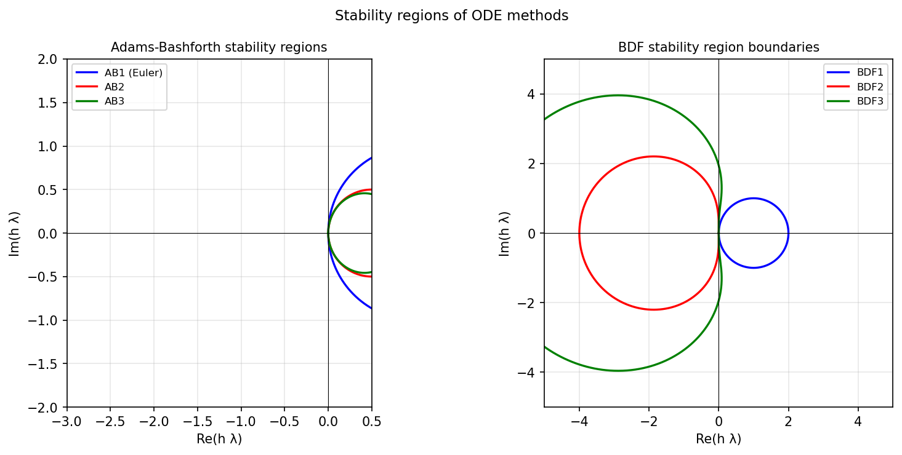

# Stability regions of ODE formulas

*Nick Trefethen, February 2011*

[Chebfun example](https://www.chebfun.org/examples/ode-linear/Regions.html)

## Overview

Plots the stability regions of classical ODE time-stepping methods
in the complex $h\lambda$ plane. Methods include Adams-Bashforth (AB1–AB4)
and BDF (BDF1–BDF4).

The stability region boundary is the set $\{ z : |R(z)| = 1 \}$
where $R(z)$ is the amplification factor of the method.

```python
import numpy as np

# Adams-Bashforth 2: R(z) = characteristic polynomial root condition
theta = np.linspace(0, 2*np.pi, 1000)
# For AB1 (forward Euler): stability boundary is circle |1+z|=1
AB1_boundary_re = np.cos(theta) - 1
AB1_boundary_im = np.sin(theta)
```



