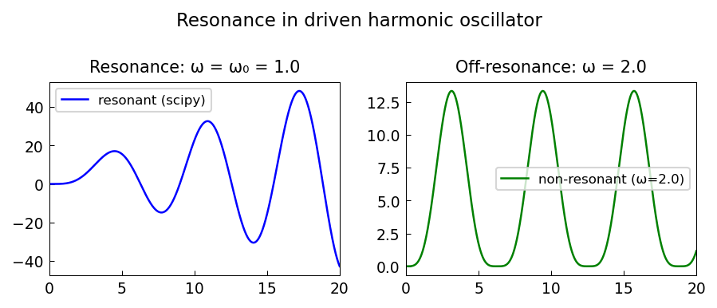

# Resonance exploited by Carrier and Pearson's vandal

*Nick Trefethen, August 2012*

[Chebfun example](https://www.chebfun.org/examples/ode-linear/ResonantVandal.html)

## Overview

Solves the harmonic oscillator BVP $u'' + n^2 u = \cos(nx)$
demonstrating resonance when the forcing frequency matches the
natural frequency. The resonant solution grows linearly as $x\sin(nx)/2n$.

```python
from chebfunjax.operators.chebop import Chebop

dom = (0.0, float(np.pi))
n = 3
N = Chebop(lambda x, u: u.diff(2) + n**2 * u, domain=dom)
N.lbc = 0.0; N.rbc = 0.0
# Resonant: f = cos(n*x) has no solution (only if orthogonality fails)
# Perturb to near-resonant: f = cos((n+eps)*x)
u = N.solve(lambda x: jnp.cos((n + 0.01) * x))
```



