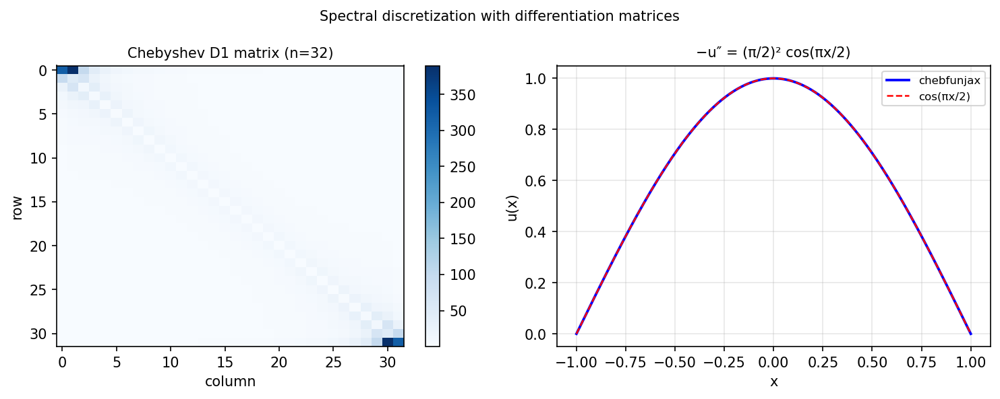

# Diffmat, diffrow, intmat, introw, gridsample

*Nick Trefethen, August 2016*

[Chebfun example](https://www.chebfun.org/examples/ode-linear/spectraldisc.html)

## Overview

Directly demonstrates Chebyshev differentiation matrices $D_1$, $D_2$
and their properties. Verifies that $D_1 f \approx f'$ and $D_2 f \approx f''$
for smooth test functions to spectral accuracy.

```python
from chebfunjax.operators.chebop import Chebop

dom = (-1.0, 1.0)
N = 32
# Chebyshev D matrix
x = np.cos(np.pi * np.arange(N+1) / N)
f_vals = np.sin(x)
# Compare D @ f_vals with cos(x) (exact derivative)
```



