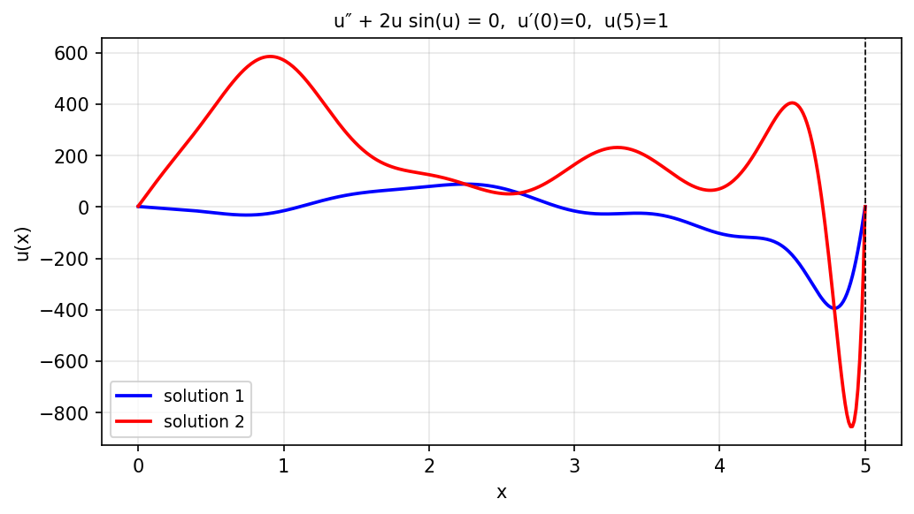

# Multiple BVP solutions by solving an IVP

*Asgeir Birkisson, May 2011*

[Chebfun example](https://github.com/chebfun/examples/blob/master/ode-linear/TwoSolBVPfromIVP.m)

## Overview

The BVP $u'' + 2u\sin(u) = 0$ with $u(0) = 1$ has multiple solutions.
Different initial guesses for the shooting parameter $u'(0)$ converge to
different branches of the solution.

```python
from chebfunjax.operators.chebop import Chebop

dom = (0.0, float(np.pi))
N = Chebop(lambda x, u: u.diff(2) + 2.0 * u * jnp.sin(u), domain=dom)
N.lbc = 1.0; N.rbc = 0.0

# Different initial guesses
for init_slope in [-1.0, 0.0, 1.0]:
    u = N.solve(0.0, u0=lambda x: 1.0 - x/np.pi + init_slope*x)
```



