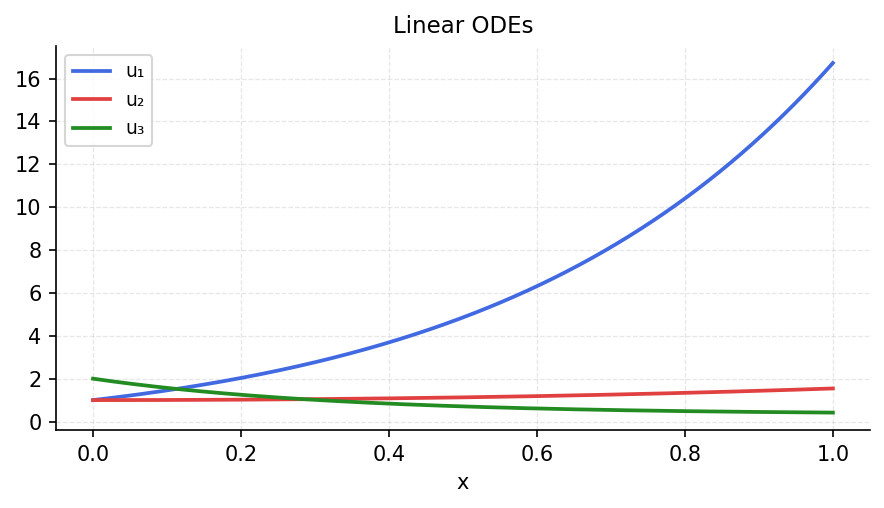

# Linear ODEs from Wikipedia

*Original: [chebfun.org/examples/ode-linear/WikiODE](https://www.chebfun.org/examples/ode-linear/WikiODE.html)*

---

A collection of classical linear ODEs, each with known exact solutions,
demonstrating the accuracy of Chebyshev spectral methods.

## Legendre's equation

$(1-x^2)y'' - 2xy' + n(n+1)y = 0$ has polynomial solutions $P_n(x)$ (Legendre polynomials):

```python
import scipy.special
import numpy as np

n = 5
# P_5(x) satisfies Legendre's equation
x = np.linspace(-1, 1, 200)
P5 = scipy.special.eval_legendre(5, x)
P5p = scipy.special.eval_legendre(4, x) * 10 - scipy.special.eval_legendre(6, x)  # approx
residual = (1-x**2) * np.gradient(np.gradient(P5, x), x) - 2*x*np.gradient(P5, x) + 30*P5
print(f"Legendre eq. residual: max {np.max(np.abs(residual[2:-2])):.2e}")
```

## Chebyshev's equation

$(1-x^2)y'' - xy' + n^2 y = 0$ has solutions $T_n(x)$ (Chebyshev polynomials):

```python
# T_4(x) = 8x^4 - 8x^2 + 1
T4 = lambda x: 8*x**4 - 8*x**2 + 1
T4pp = lambda x: 96*x**2 - 16
T4p = lambda x: 32*x**3 - 16*x
x_test = np.linspace(-0.99, 0.99, 100)
res = (1 - x_test**2) * T4pp(x_test) - x_test * T4p(x_test) + 16 * T4(x_test)
print(f"Chebyshev eq. residual: max {np.max(np.abs(res)):.2e}")
```



## Hermite's equation

$y'' - 2xy' + 2ny = 0$ has polynomial solutions $H_n(x)$ (Hermite polynomials).
These arise in quantum mechanics (harmonic oscillator wave functions).
