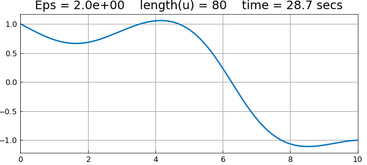
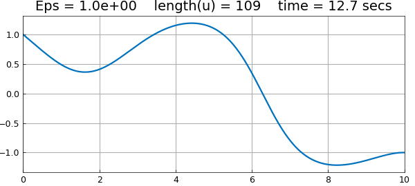
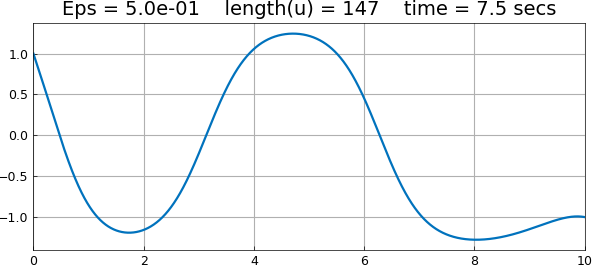
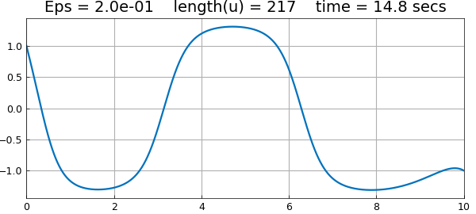
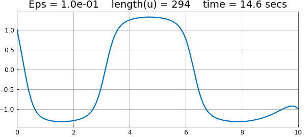
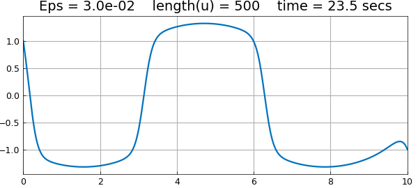
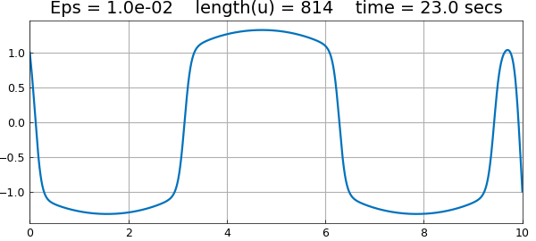
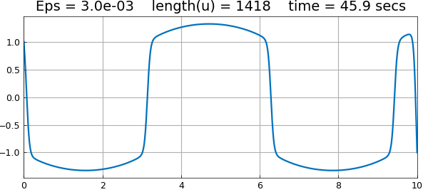

# An Allen-Cahn equation with continuation

*Nick Trefethen, November 2010*

[Original MATLAB Chebfun example](https://www.chebfun.org/examples/ode-nonlin/AllenCahn.html)

Python translation: [`examples/ode-nonlin/allen_cahn.py`](https://github.com/ma-gilles/chebfunjax/blob/main/examples/ode-nonlin/allen_cahn.py)

The Allen-Cahn equation is a reaction-diffusion that arises in material science:

$$ u_{tt} = \varepsilon u'' +u-u^3, $$

where $\varepsilon$ is a small parameter. Here as an ODE boundary-value problem we shall consider a steady-state version of this problem on the interval $[0,10]$ with a sinusoidal forcing term:

$$ \varepsilon u'' + u - u^3 = \sin(x),\qquad u(0) = 1,~~ u(10) = -1. $$

If we try a very small value of $\varepsilon$ without a well-chosen initial guess, Chebfun will not converge. Instead let's begin by solving the problem with the rather large value $\varepsilon = 2$.

```matlab
Eps = 2;
dom = [0, 10];
x = chebfun('x', dom);
f = sin(x);
cheboppref.setDefaults('plotting', 0.01)
N = chebop(@(u) Eps*diff(u,2) + u - u.^3,dom, 1, -1);
tic, u = N\f; t = toc;

LW = 'linewidth'; lw = 1.6; FS = 'fontsize'; fs = 14;
close, plot(u,LW,lw)
s = 'Eps = %5.1e    length(u) = %d    time = %3.1f secs';
title(sprintf(s,Eps,length(u),t),FS,fs)
```



We now progressively reduce $\varepsilon$ to get sharper and sharper solutions. We use a simple continuation method, in which the initial guess for each iteration is the previous solution. For each value of $\varepsilon$, the solution for the previous value of $\varepsilon$ is a good initial guess of the new solution, so we can turn off damping for the Newton iteration:

```matlab
cheboppref.setDefaults('damping', 0)
Epsvec = [1 .5 .2 .1 .03 .01 .003];
for j = 1:length(Epsvec)
  close all
  Eps = Epsvec(j);
  N = chebop(@(u) Eps*diff(u,2)+u-u.^3,dom,1,-1);
  N.init = u;
  tic, u = N\f; t = toc;
  close, plot(u,LW,lw)
  title(sprintf(s,Eps,length(u),t),FS,fs), snapnow
end
```















---

*Translated with [chebfunjax](https://github.com/ma-gilles/chebfunjax); prose and MATLAB code from the original example, copyright The University of Oxford and The Chebfun Developers.  Printed outputs and figures are chebfunjax's.*
