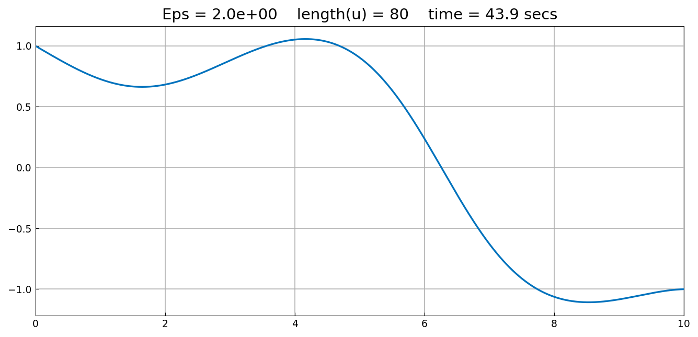
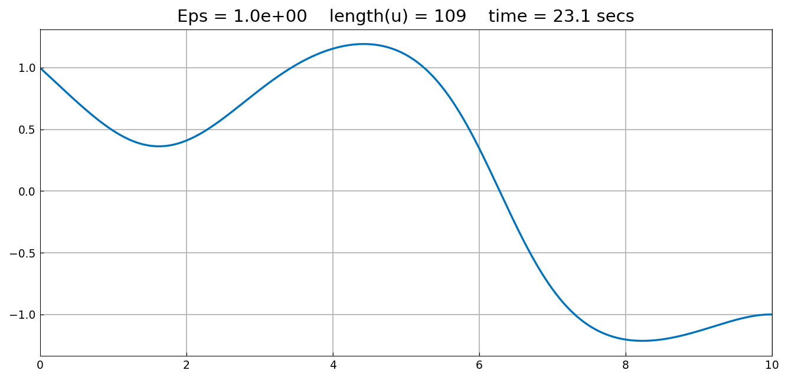
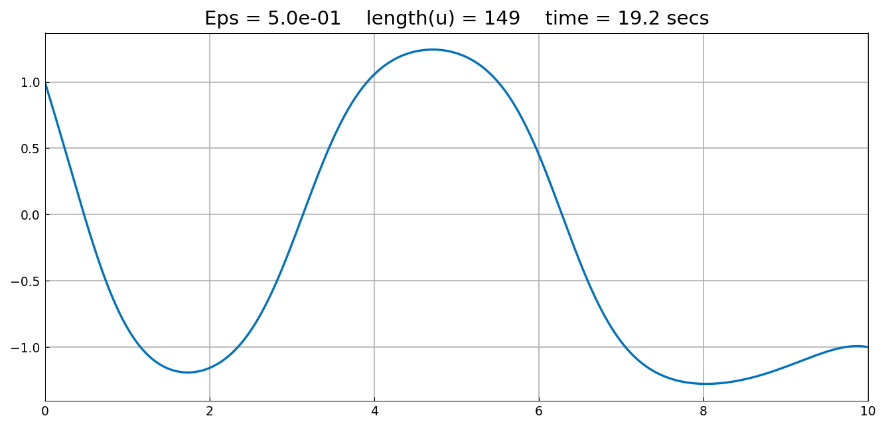
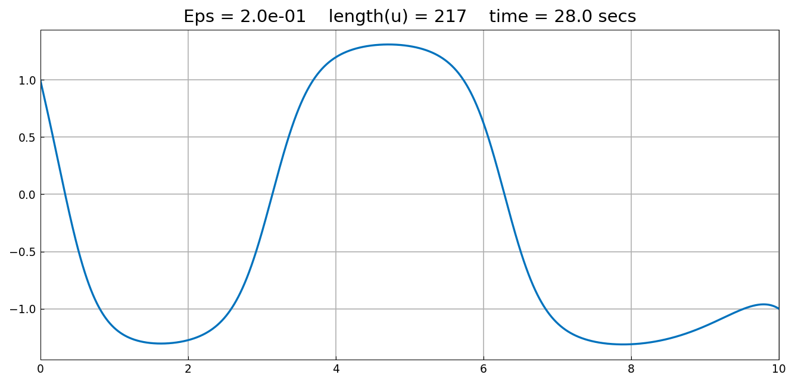
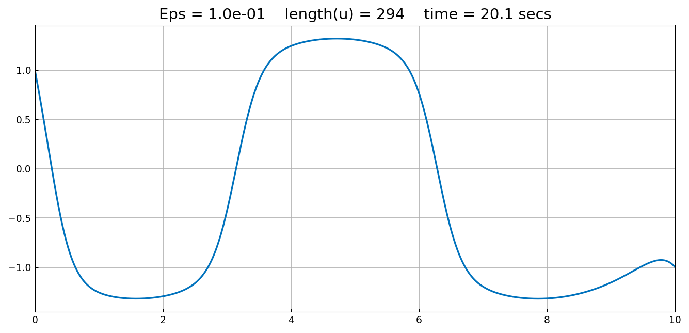
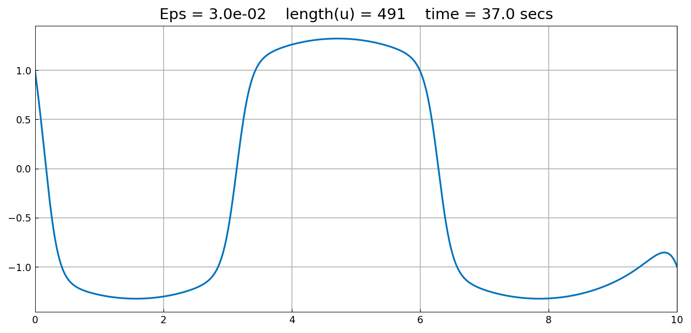
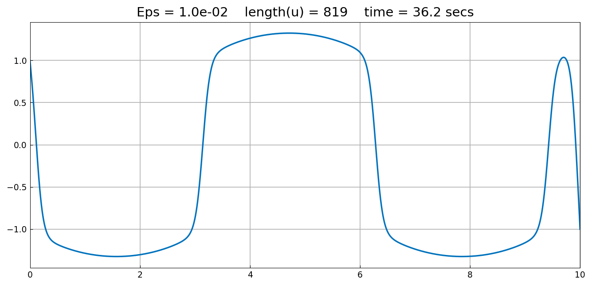
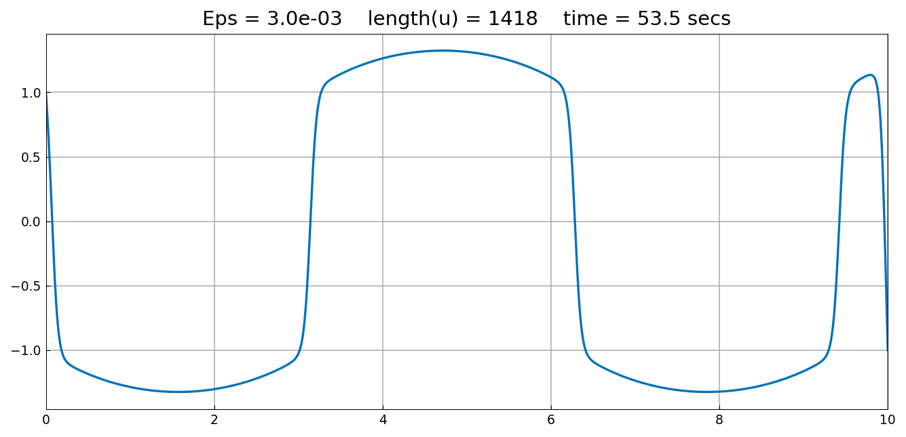

# An Allen-Cahn equation with continuation

[Original MATLAB Chebfun example](https://www.chebfun.org/examples/ode-nonlin/AllenCahn.html)

(Chebfun example ode-nonlin/AllenCahn.m)

The steady Allen-Cahn problem

$$ \varepsilon u'' + u - u^3 = \sin(x), \qquad u(0) = 1, \; u(10) = -1 $$

develops interior layers of width $O(\sqrt{\varepsilon})$ as
$\varepsilon \to 0$. Solving directly at small $\varepsilon$ is hard;
the classical remedy is *continuation* — solve at $\varepsilon = 2$,
then walk $\varepsilon$ down through
$1, 0.5, 0.2, 0.1, 0.03, 0.01, 0.003$, each solve starting from the
previous solution:

```python
N = Chebop(lambda u: eps*u.diff(2) + u - u**3, (0, 10), 1, -1)
u = N.solve(f)                     # eps = 2, from the default guess
for eps in (1, .5, .2, .1, .03, .01, .003):
    N = Chebop(lambda u, _e=eps: _e*u.diff(2) + u - u**3, (0, 10), 1, -1)
    N.init = u                     # continuation
    u = N.solve(f)
```










The lengths grow as the layers sharpen — 80, 109, 149, 217, 294, 491,
819, 1418 — the expected $O(\varepsilon^{-1/2})$ pattern (MATLAB's
figure titles show the same growth, e.g. 421 at
$\varepsilon = 3\times 10^{-2}$ against our 491).

At $\varepsilon = 0.003$ the residual of our solution is
$4.2\times 10^{-8}$ with both boundary conditions exact. The interfaces
at $x \approx 0.1, 3.1, 6.2$ match the published figure; near the right
boundary the two computations part company — ours carries a full
interface pair near $x \approx 9.2$ where MATLAB's solution has only a
sub-critical bump. Both are genuine steady states: at small
$\varepsilon$ this equation has many, and which one a Newton
continuation lands on depends on the details of the iteration, as with
the branch selection in [Carrier](Carrier.md).

> **Implementation note.** This page initially produced garbage —
> length stuck at 32, amplitude $\sim 400$, residual $1.05$ — and the
> cause was the arity trap found on
> [BlowupFK](BlowupFK.md), still open in *nine more places*: the
> continuation loop's `lambda u, _e=eps:` was miscounted as a
> two-argument `op(x, u)` by, among others, the operator-order sniffer
> and the automatic-differentiation linearization, so the Jacobian was
> built with the unknown and the captured constant swapped. Arity
> detection is now centralized in one helper that counts only required
> positional parameters, and every consumer in the library routes
> through it.

---

*Replica script: [`examples/ode-nonlin/allen_cahn_replica.py`](https://github.com/ma-gilles/chebfunjax/blob/main/examples/ode-nonlin/allen_cahn_replica.py).
Original example copyright by The University of Oxford and The Chebfun
Developers.*
