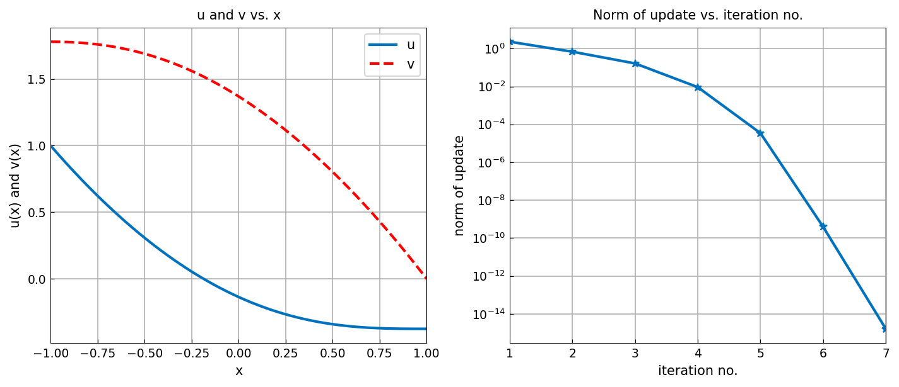
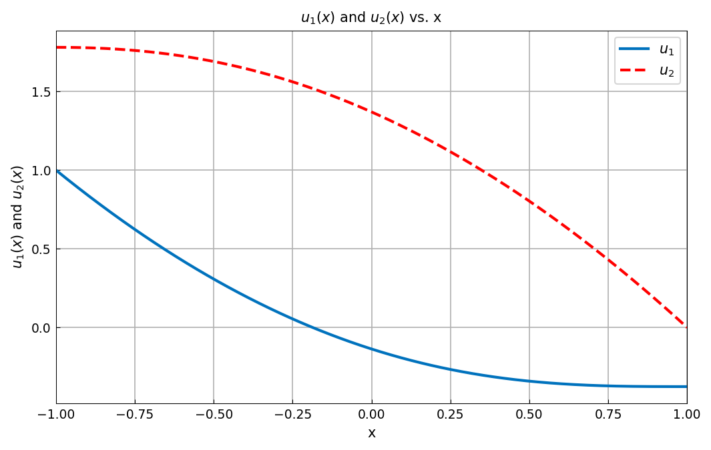

# System of two nonlinear BVPs

*Asgeir Birkisson and Toby Driscoll, September 2010*

[Original MATLAB Chebfun example](https://www.chebfun.org/examples/ode-nonlin/BVPSystem.html)

(Chebfun example ode-nonlin/BVPSystem.m)

## System of equations

Here is a system of two coupled nonlinear ODEs on the interval
$[-1,1]$, with boundary conditions:

$$ u'' - \sin(v) = 0, $$

$$ v'' + \cos(u) = 0, $$

$$ u(-1) = 1, \quad v'(-1) = 0, \quad u'(1) = 0, \quad v(1) = 0. $$

## Solution using multiple variables `u` and `v`

One way to solve a problem like this is to work with multiple
variables, solving for two chebfuns $u$ and $v$, setting up the problem
with functions that take two chebfuns as input and return two as
output:

```python
N = Chebop(lambda x, u, v: [u.diff(2) - v.sin(), v.diff(2) + u.cos()],
           domain=(-1, 1))
N.lbc = lambda u, v: [u - 1, v.diff()]
N.rbc = lambda u, v: [v, u.diff()]
(u, v), info = N.solvebvp([0, 0])
nrmduvec = info["normDelta"]
```

We can now plot the solution components $u$ and $v$, alongside the norm
of the Newton update at each iteration:



The boundary conditions are met to rounding:

```text
u(-1) = 1.000000000000000   (exact 1)
v(1)  = 4.441e-16           (exact 0)
u'(1) = -1.907e-14          (exact 0)
v'(-1)= -2.147e-14          (exact 0)
```

and the Newton iteration converges quadratically in seven steps, as in
the published figure:

```text
2.318430e+00
6.874518e-01
1.654200e-01
9.248700e-03
3.461500e-05
3.944700e-10
1.624586e-15
```

## Solution using a single indexed variable

Another way to solve the same problem is to work with a single variable
of two components, `u{1}` and `u{2}` — in MATLAB a chebmatrix. The
solution comes back the same way, so indexing the returned pair
reproduces it:



The two formulations agree exactly (maximum difference $0$), as they
must: they are the same discretization written two ways.

> **Implementation note.** This page needed two fixes to the nonlinear
> *system* solver. `info.normDelta` was empty for systems — only the
> scalar path ever recorded it — so the right-hand figure had nothing to
> plot. And the iteration's only stopping test compared `max|R|` on the
> residual, whose derivative rows carry an $n^2$ scaling and can sit
> above the threshold long after the iterate stops moving; the solve ran
> fifteen iterations here, the last eight at machine-precision noise.
> Adding MATLAB's update-norm stop removes them, which speeds up every
> nonlinear system solve, not just this one.
>
> The reported norm also had to change. MATLAB gives the *chebfun* norm
> of the update, an $L^2$ function norm; we were reporting the Euclidean
> norm of the discrete coefficient vector, larger by roughly $\sqrt{n}$
> — with $n = 22$ our first value was $11.5$ against the published
> $\approx 2$.

---

*Replica script: [`examples/ode-nonlin/bvp_system_replica.py`](https://github.com/ma-gilles/chebfunjax/blob/main/examples/ode-nonlin/bvp_system_replica.py).
Original example copyright by The University of Oxford and The Chebfun
Developers.*
